# Tài Liệu Kỹ Thuật — Hệ Thống Đặt Lịch KOL (Frontend)

---

## Mục Lục

1. [Giới thiệu hệ thống](#1-giới-thiệu-hệ-thống)
2. [Mục tiêu phát triển](#2-mục-tiêu-phát-triển)
3. [Phạm vi hệ thống](#3-phạm-vi-hệ-thống)
4. [Kiến trúc tổng thể](#4-kiến-trúc-tổng-thể)
5. [Công nghệ sử dụng (Tech Stack)](#5-công-nghệ-sử-dụng-tech-stack)
6. [Cấu trúc source code](#6-cấu-trúc-source-code)
7. [Kiến trúc Backend](#7-kiến-trúc-backend)
8. [Kiến trúc Frontend](#8-kiến-trúc-frontend)
9. [Thiết kế cơ sở dữ liệu](#9-thiết-kế-cơ-sở-dữ-liệu)
10. [Mô tả từng bảng dữ liệu](#10-mô-tả-từng-bảng-dữ-liệu)
11. [Quan hệ giữa các bảng](#11-quan-hệ-giữa-các-bảng)
12. [Luồng xử lý nghiệp vụ](#12-luồng-xử-lý-nghiệp-vụ)
13. [Danh sách API](#13-danh-sách-api)
14. [Authentication & Authorization](#14-authentication--authorization)
15. [Validation Rules](#15-validation-rules)
16. [Business Rules](#16-business-rules)
17. [Queue / Background Jobs](#17-queue--background-jobs)
18. [Event Flow](#18-event-flow)
19. [Cache](#19-cache)
20. [File Storage](#20-file-storage)
21. [Logging & Monitoring](#21-logging--monitoring)
22. [Error Handling](#22-error-handling)
23. [Security](#23-security)
24. [Cấu hình môi trường (.env)](#24-cấu-hình-môi-trường-env)
25. [Hướng dẫn chạy project](#25-hướng-dẫn-chạy-project)
26. [Build & Deploy](#26-build--deploy)
27. [Testing](#27-testing)
28. [Coding Convention](#28-coding-convention)
29. [Performance Considerations](#29-performance-considerations)
30. [Những hạn chế hiện tại](#30-những-hạn-chế-hiện-tại)
31. [Hướng phát triển trong tương lai](#31-hướng-phát-triển-trong-tương-lai)
32. [Phụ lục](#32-phụ-lục)

---

## 1. Giới thiệu hệ thống

Hệ thống là một nền tảng thương mại điện tử chuyên biệt kết nối **nhãn hàng (Brand)** với **người sáng tạo nội dung có tầm ảnh hưởng (KOL — Key Opinion Leader)**. Nền tảng cho phép nhãn hàng tìm kiếm, lựa chọn và đặt lịch hợp tác với KOL phù hợp để triển khai các chiến dịch marketing, đồng thời cung cấp cơ chế quản lý hợp đồng, giao nhận nội dung và thanh toán theo quy trình khép kín.

Phía frontend được xây dựng bằng **Next.js 16** (App Router) và triển khai trên **Vercel**. Giao tiếp với backend REST API viết bằng **Spring Boot**, được host tại `https://kol-booking-backend.onrender.com/api/v1`.

### 1.1 Vai trò người dùng

Hệ thống có ba nhóm người dùng chính:

| Vai trò | Mô tả |
|---------|-------|
| **BRAND** | Nhãn hàng, đại lý quảng cáo. Đăng yêu cầu, đặt lịch KOL, thanh toán, duyệt nội dung. |
| **KOL** | Người sáng tạo nội dung. Xây dựng hồ sơ, nhận đặt lịch, nộp nội dung, nhận thanh toán. |
| **ADMIN** | Quản trị viên nền tảng. Duyệt hồ sơ, giải quyết tranh chấp, quản lý hoa hồng. |

### 1.2 Kết luận chương

Hệ thống giải quyết bài toán thiếu kênh trung gian đáng tin cậy trong thị trường influencer marketing tại Việt Nam, bằng cách chuẩn hóa quy trình đặt lịch và bảo vệ quyền lợi cả hai phía thông qua cơ chế escrow.

---

## 2. Mục tiêu phát triển

### 2.1 Mục tiêu chính

- Xây dựng giao diện người dùng đầy đủ chức năng cho ba vai trò: BRAND, KOL và ADMIN.
- Tích hợp luồng xác thực JWT bảo mật với khả năng tự động làm mới token.
- Hiện thực hóa quy trình đặt lịch từ đầu đến cuối: tạo booking → thanh toán → giao nội dung → hoàn thành.
- Cung cấp hệ thống thông báo thời gian thực qua Server-Sent Events.
- Triển khai lưu trữ file qua Cloudflare R2 với API endpoint riêng.
- Hỗ trợ trang quản trị (Admin Dashboard) với biểu đồ phân tích dữ liệu.

### 2.2 Mục tiêu phi chức năng

- Thời gian tải trang nhanh nhờ Next.js App Router và React Server Components.
- Khả năng mở rộng giao diện theo vai trò mà không cần tái cấu trúc lớn.
- Đảm bảo trải nghiệm người dùng nhất quán trên cả desktop và mobile.
- Mã nguồn rõ ràng, có thể bảo trì lâu dài.

### 2.3 Kết luận chương

Các mục tiêu trên định hình toàn bộ kiến trúc của hệ thống: từ lựa chọn framework, phương án quản lý trạng thái đến cấu trúc thư mục và chiến lược triển khai.

---

## 3. Phạm vi hệ thống

### 3.1 Trong phạm vi (In-scope)

- Luồng xác thực: đăng ký, đăng nhập, xác minh email, quên/đặt lại mật khẩu.
- Quản lý hồ sơ KOL: thông tin cơ bản, kênh mạng xã hội, gói dịch vụ, portfolio.
- Quản lý hồ sơ Brand: thông tin doanh nghiệp, logo, mô tả.
- Tìm kiếm và khám phá KOL với bộ lọc đa chiều.
- Luồng đặt lịch: tạo, chấp nhận/từ chối, thanh toán, giao nội dung, duyệt, hoàn thành.
- Quản lý đăng tuyển (Product): Brand đăng yêu cầu, KOL ứng tuyển.
- Ví điện tử: xem số dư, lịch sử giao dịch, yêu cầu rút tiền.
- Thông báo thời gian thực qua SSE.
- Trang quản trị đầy đủ chức năng cho ADMIN.
- Upload file lên Cloudflare R2.
- Dashboard phân tích cho BRAND và KOL.

### 3.2 Ngoài phạm vi (Out-of-scope)

- Logic backend (Spring Boot): hệ thống chỉ giao tiếp qua REST API.
- Xử lý thanh toán trực tiếp: gateway (VNPAY, MOMO, Stripe) được xử lý bởi backend.
- Gửi email: thực hiện bởi backend qua Resend.
- Quản lý cơ sở dữ liệu.
- Hệ thống AI matching: frontend chỉ hiển thị kết quả từ endpoint AI.

### 3.3 Kết luận chương

Phạm vi được định nghĩa rõ ràng giúp tránh mở rộng ngoài kiểm soát (scope creep) và tập trung nguồn lực vào những tính năng mang lại giá trị trực tiếp cho người dùng cuối.

---

## 4. Kiến trúc tổng thể

### 4.1 Sơ đồ kiến trúc hệ thống

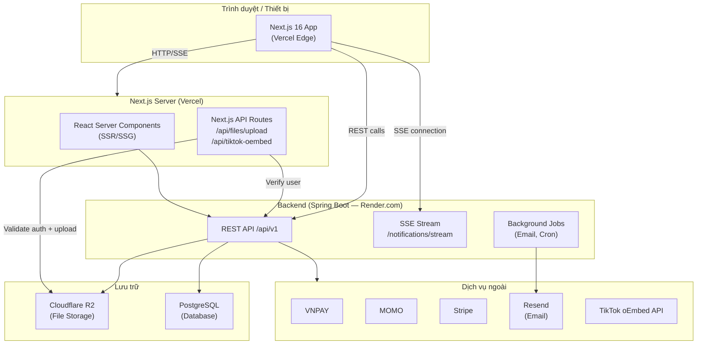

### 4.2 Mô hình triển khai

| Thành phần | Nền tảng | URL |
|-----------|---------|-----|
| Frontend (Next.js) | Vercel | `https://kol-booking-frontend.vercel.app` |
| Backend (Spring Boot) | Render.com | `https://kol-booking-backend.onrender.com` |
| File Storage | Cloudflare R2 | (R2 Public URL cấu hình theo môi trường) |
| Database | PostgreSQL | Host bởi Render.com |

### 4.3 Luồng request cơ bản

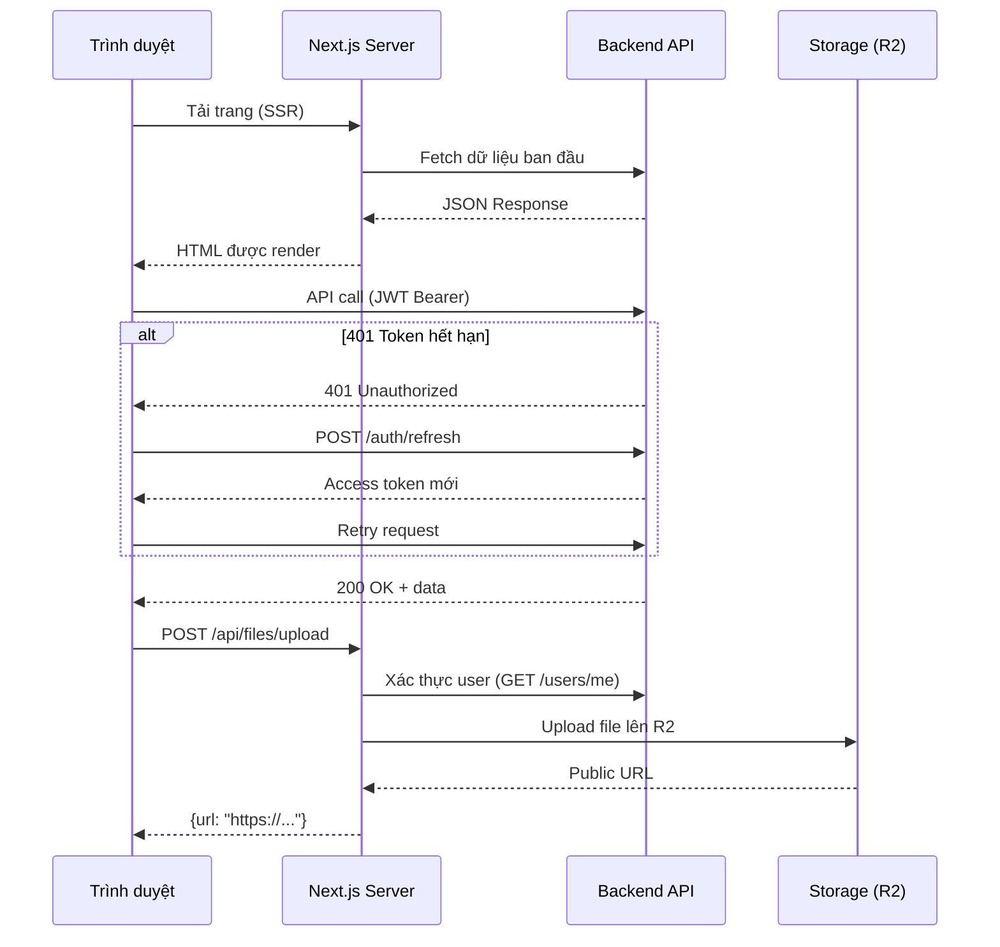

### 4.4 Kết luận chương

Kiến trúc phân tầng rõ ràng (Frontend → API Routes → Backend → Storage) cho phép mỗi tầng phát triển độc lập. Việc sử dụng Next.js App Router tận dụng tối đa khả năng render phía server mà vẫn duy trì trải nghiệm SPA phía client.

---

## 5. Công nghệ sử dụng (Tech Stack)

### 5.1 Bảng công nghệ chi tiết

| Nhóm | Công nghệ | Phiên bản | Mục đích |
|------|-----------|-----------|---------|
| **Framework** | Next.js | 16.2.0 | App Router, SSR/SSG, API Routes |
| **UI Library** | React | 19.2.4 | Component model |
| **Ngôn ngữ** | TypeScript | ~5 | Type safety toàn bộ codebase |
| **Styling** | Tailwind CSS | 4.2.0 | Utility-first CSS với CSS variables |
| **Component** | Radix UI | Đa gói | Accessible UI primitives (40+ packages) |
| **Form** | react-hook-form | 7.54.1 | Quản lý form state và validation |
| **Validation** | Zod | 3.24.1 | Type-safe schema validation |
| **Charts** | Recharts | 2.15.0 | Biểu đồ admin dashboard |
| **Icons** | lucide-react | 0.564.0 | Icon system thống nhất |
| **Toast** | sonner | 1.7.1 | Thông báo nhanh (toast notifications) |
| **Storage SDK** | @aws-sdk/client-s3 | 3.1070.0 | Tích hợp Cloudflare R2 (S3-compatible) |
| **Analytics** | @vercel/analytics | — | Theo dõi lượt truy cập production |
| **Testing** | Playwright | — | End-to-end testing |
| **Package Manager** | pnpm | 11.5.0 | Quản lý dependencies |
| **Deployment** | Vercel | — | Hosting + CI/CD |

### 5.2 Lý do lựa chọn

- **Next.js App Router**: Hỗ trợ React Server Components giảm JavaScript gửi đến client, đồng thời tích hợp sẵn API Routes cho upload file.
- **Tailwind CSS 4 + Radix UI**: Kết hợp giữa thiết kế linh hoạt (utility classes) và accessibility sẵn có (Radix primitives), giảm công sức viết ARIA từ đầu.
- **react-hook-form + Zod**: Validation phía client hiệu suất cao; Zod schema có thể tái sử dụng giữa form và API call.
- **pnpm**: Tiết kiệm dung lượng disk và tốc độ cài đặt nhanh hơn npm/yarn nhờ content-addressable store.

### 5.3 Kết luận chương

Tech stack được lựa chọn dựa trên tiêu chí: hiệu suất, trải nghiệm phát triển tốt, hỗ trợ TypeScript đầy đủ và cộng đồng lớn. Sự kết hợp giữa Next.js và Vercel cho phép CI/CD zero-config.

---

## 6. Cấu trúc source code

### 6.1 Sơ đồ thư mục tổng quan

```
kol_booking-frontend/
├── app/                        # Next.js App Router
│   ├── layout.tsx              # Root layout (fonts, providers, analytics)
│   ├── page.tsx                # Trang chủ
│   ├── api/                    # Next.js API Routes (server-side)
│   │   ├── files/upload/       # Upload file lên R2
│   │   └── tiktok-oembed/      # Proxy TikTok oEmbed API
│   ├── auth/                   # Luồng xác thực
│   ├── dashboard/              # Dashboard (BRAND/KOL)
│   ├── discover/               # Tìm kiếm KOL
│   ├── bookings/               # Quản lý đặt lịch
│   ├── products/               # Đăng tuyển / ứng tuyển
│   ├── kol-dashboard/          # KOL: hồ sơ, analytics, ví
│   ├── kol-profiles/           # Hồ sơ KOL công khai
│   ├── brand/                  # Hồ sơ Brand công khai
│   ├── admin/                  # Trang quản trị
│   ├── wallet/                 # Ví điện tử
│   ├── profile/                # Cài đặt hồ sơ người dùng
│   ├── reviews/                # Đánh giá nhận được
│   ├── notifications/          # Trang thông báo
│   ├── applications/           # KOL: đơn ứng tuyển của tôi
│   ├── ai-assistant/           # Hỗ trợ AI matching
│   ├── brand-analytics/        # Phân tích chi tiêu (BRAND)
│   └── payment/result/         # Callback thanh toán
├── components/                 # React components dùng chung
│   ├── ui/                     # Radix UI primitives (40+ files)
│   └── [domain components]     # Components theo nghiệp vụ
├── lib/                        # Utilities & API client
│   ├── api/                    # HTTP client + tất cả API modules
│   ├── bookings/               # Helpers nghiệp vụ đặt lịch
│   ├── storage/                # Cloudflare R2 upload helper
│   ├── uploads/                # File validation
│   ├── auth/                   # Token parsing, redirect logic
│   ├── categories/             # Category display helpers
│   └── [other helpers]
├── hooks/                      # Custom React hooks
├── contexts/                   # React contexts (AuthContext)
├── public/                     # Static assets
├── next.config.mjs             # Next.js configuration
├── tailwind.config.ts          # Tailwind configuration
├── tsconfig.json               # TypeScript configuration
├── package.json
├── pnpm-lock.yaml
└── .env.local.example          # Template biến môi trường
```

### 6.2 Quy ước đặt tên tệp

| Loại tệp | Quy ước | Ví dụ |
|---------|---------|-------|
| Page component | `page.tsx` | `app/bookings/[id]/page.tsx` |
| Layout | `layout.tsx` | `app/layout.tsx` |
| API Route | `route.ts` | `app/api/files/upload/route.ts` |
| Domain component | `kebab-case.tsx` | `booking-form.tsx` |
| UI primitive | `kebab-case.tsx` | `components/ui/button.tsx` |
| API module | `kebab-case.ts` | `lib/api/bookings.ts` |
| Custom hook | `use-*.ts` | `hooks/use-sse.ts` |
| Type definitions | `types.ts` | `lib/api/types.ts` |

### 6.3 Path Aliases

Dự án cấu hình alias `@/*` trỏ đến thư mục gốc:

```json
// tsconfig.json
{
  "compilerOptions": {
    "paths": {
      "@/*": ["./*"]
    }
  }
}
```

Import từ bất kỳ đâu có thể dùng: `import { api } from "@/lib/api/client"`.

### 6.4 Kết luận chương

Cấu trúc thư mục phản ánh tính năng theo domain (feature-based), giúp developer dễ định vị code liên quan. Việc tách `lib/api/` thành các module nhỏ (auth, bookings, kol, ...) giúp bảo trì từng tính năng mà không ảnh hưởng các phần khác.

---

## 7. Kiến trúc Backend

> **Lưu ý:** Phần này mô tả backend từ góc nhìn của frontend, dựa trên hợp đồng API (API contract) quan sát được qua các module trong `lib/api/`.

### 7.1 Tổng quan

Backend được xây dựng bằng **Spring Boot** (Java), expose REST API tại base URL `/api/v1`. Backend chịu trách nhiệm:

- Xác thực và phân quyền (JWT-based).
- Quản lý toàn bộ dữ liệu nghiệp vụ (booking, profile, wallet, ...).
- Gửi email qua Resend.
- Tích hợp cổng thanh toán (VNPAY, MOMO, Stripe).
- Stream thông báo thời gian thực qua SSE.
- Lưu trữ file (Cloudflare R2 — cấu hình phía backend).

### 7.2 API Base URL

| Môi trường | URL |
|-----------|-----|
| Development | `http://localhost:8081/api/v1` |
| Production | `https://kol-booking-backend.onrender.com/api/v1` |

### 7.3 Cấu trúc response chuẩn

```typescript
interface ApiResponse<T> {
  success: boolean;
  data: T;
  message: string;
  errorCode?: string;
}

interface PageResponse<T> {
  content: T[];
  totalElements: number;
  totalPages: number;
  currentPage: number;
  pageSize: number;
  hasNext: boolean;
  hasPrevious: boolean;
}
```

### 7.4 Nhóm endpoint chính

| Nhóm | Prefix | Mô tả |
|------|--------|-------|
| Auth | `/auth` | Đăng nhập, đăng ký, refresh token, email verify |
| Users | `/users` | Thông tin người dùng, profile |
| KOLs | `/kols` | Hồ sơ KOL, channels, packages, portfolio, search |
| Brands | `/brands` | Hồ sơ Brand, public profile |
| Bookings | `/bookings` | Toàn bộ vòng đời đặt lịch |
| Products | `/products` | Đăng tuyển, ứng tuyển |
| Payments | `/payments` | Checkout, trạng thái thanh toán |
| Wallet | `/wallet` | Số dư, giao dịch |
| Notifications | `/notifications` | Thông báo + SSE stream |
| Reviews | `/reviews` | Đánh giá |
| Categories | `/categories` | Danh mục |
| Admin | (nhiều prefix) | Quản trị người dùng, duyệt hồ sơ, thống kê |

### 7.5 Kết luận chương

Backend hoạt động như một monolith cung cấp toàn bộ logic nghiệp vụ. Frontend chỉ phụ thuộc vào hợp đồng API — mọi thay đổi nội bộ phía backend không ảnh hưởng frontend miễn là response schema giữ nguyên.

---

## 8. Kiến trúc Frontend

### 8.1 Mô hình rendering

Hệ thống sử dụng **Next.js App Router** với chiến lược rendering hỗn hợp:

| Loại trang | Chiến lược | Lý do |
|-----------|-----------|-------|
| Trang chủ, KOL profile | SSR / ISR | SEO quan trọng |
| Dashboard, Admin | Client-side | Dữ liệu real-time, user-specific |
| Auth pages | Client-side | Tương tác form |
| API Routes | Server-side | Bảo mật credentials (R2 keys) |

### 8.2 Quản lý trạng thái (State Management)

Hệ thống không dùng thư viện quản lý trạng thái toàn cục (Redux, Zustand). Thay vào đó:

- **AuthContext** (`contexts/AuthContext.tsx`): Trạng thái xác thực toàn cục — user info, login/logout functions.
- **React useState + useEffect**: Trạng thái cục bộ trong từng page component.
- **react-hook-form**: Form state, validation state.
- **Server state**: Mỗi page tự fetch dữ liệu riêng, không cache tập trung.

### 8.3 Luồng dữ liệu

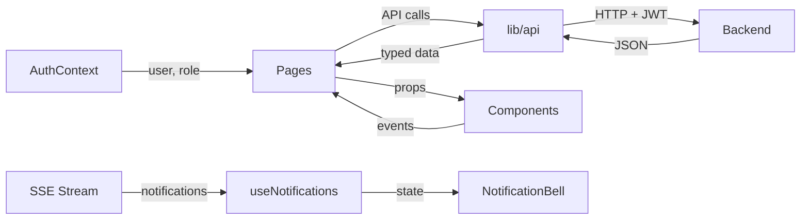

### 8.4 Hệ thống routing

**Route Groups (App Router):**

```
app/
├── (public)/           # Không có nhóm rõ ràng — public routes
│   ├── page.tsx        # /
│   ├── discover/       # /discover
│   └── kol-profiles/   # /kol-profiles
├── auth/               # /auth/*
├── dashboard/          # /dashboard (BRAND/KOL)
├── admin/              # /admin/* (ADMIN only — guard trong component)
└── kol-dashboard/      # /kol-dashboard/* (KOL only)
```

**Route Protection:** Không dùng Next.js middleware. Guard được thực hiện trong mỗi page component thông qua:
1. `useAuth()` hook để lấy `user` và `role`.
2. `EmailVerificationGate` component — redirect về `/auth/login` nếu chưa đăng nhập.
3. Kiểm tra `user.role` trong từng page để render nội dung phù hợp.

### 8.5 Cây component tổng quan

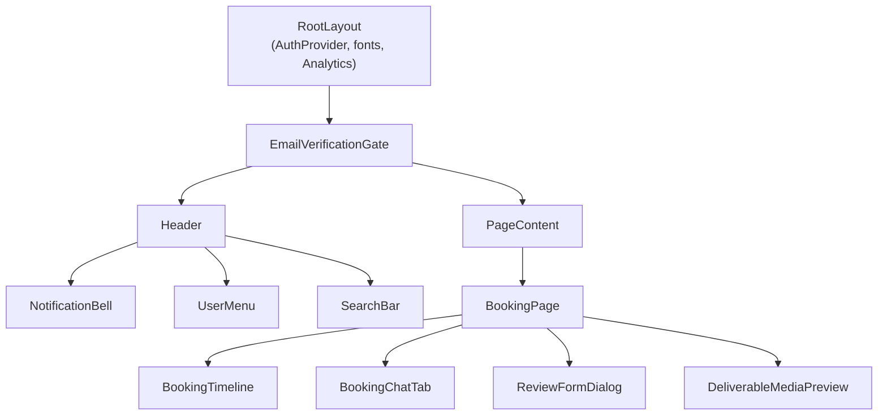

### 8.6 Kết luận chương

Kiến trúc frontend đơn giản, ít abstraction. Quyết định không dùng state management library giữ codebase dễ hiểu nhưng tạo ra một số vấn đề về dữ liệu stale khi nhiều tab cùng mở — được đề cập ở chương [Hạn chế](#30-những-hạn-chế-hiện-tại).

---

## 9. Thiết kế cơ sở dữ liệu

> **Lưu ý:** Schema được suy luận từ API response types và business logic trong frontend. Schema thực tế do backend (Spring Boot + PostgreSQL) quản lý và có thể có thêm các cột/ràng buộc không phản ánh qua API.

### 9.1 Sơ đồ quan hệ thực thể (ERD)

```mermaid
erDiagram
    USERS {
        uuid id PK
        string email UK
        string password_hash
        enum role "ADMIN|BRAND|KOL"
        enum status "PENDING_VERIFICATION|ACTIVE|BANNED|INACTIVE"
        boolean email_verified
        timestamp created_at
        timestamp updated_at
    }

    KOL_PROFILES {
        uuid id PK
        uuid user_id FK
        string display_name
        string slug UK
        string bio
        string avatar
        string cover
        enum gender "MALE|FEMALE|OTHER"
        date dob
        string city
        string country
        enum status "DRAFT|PENDING_REVIEW|APPROVED|REJECTED"
        string rejection_reason
        float avg_rating
        int review_count
        timestamp created_at
        timestamp updated_at
    }

    BRAND_PROFILES {
        uuid id PK
        uuid user_id FK
        string business_name
        string tax_code
        string logo
        string cover
        string website
        string description
        string contact_phone
        string email
        enum status "DRAFT|PENDING_REVIEW|APPROVED|REJECTED"
        string rejection_reason
        timestamp created_at
        timestamp updated_at
    }

    CHANNELS {
        uuid id PK
        uuid kol_id FK
        enum platform "TIKTOK|INSTAGRAM|YOUTUBE|FACEBOOK"
        string username
        int followers
        string url
        float engagement
        boolean verified
    }

    PRICING_PACKAGES {
        uuid id PK
        uuid kol_id FK
        enum type "POST|STORY|VIDEO|SHOUTOUT|LONG_FORM|CUSTOM"
        enum platform "TIKTOK|INSTAGRAM|YOUTUBE|FACEBOOK"
        decimal price
        string description
    }

    PORTFOLIO_ITEMS {
        uuid id PK
        uuid kol_id FK
        string title
        string campaign_name
        enum media_type "IMAGE|VIDEO"
        string media_url
    }

    BOOKINGS {
        uuid id PK
        uuid kol_id FK
        uuid brand_id FK
        string title
        text brief
        text deliverables
        decimal budget
        enum status "PENDING|ACCEPTED|REJECTED|CANCELLED|IN_PROGRESS|DELIVERED|COMPLETED|DISPUTED|CANCELLED_BY_ADMIN|DELIVERY_REJECTED"
        float platform_fee_percent
        decimal platform_fee_amount
        decimal kol_net_amount
        string revision_feedback
        string invoice_url
        date start_date
        date end_date
        timestamp created_at
        timestamp updated_at
    }

    SUBMITTED_DELIVERABLES {
        uuid id PK
        uuid booking_id FK
        string url
        string note
        enum platform "TIKTOK|INSTAGRAM|YOUTUBE|FACEBOOK"
        timestamp created_at
    }

    BOOKING_MESSAGES {
        uuid id PK
        uuid booking_id FK
        uuid sender_id FK
        enum sender_role "BRAND|KOL"
        text message
        timestamp created_at
    }

    PRODUCTS {
        uuid id PK
        uuid brand_id FK
        string title
        text description
        json required_stats
        decimal budget
        enum status "OPEN|CLOSED"
        int application_count
        timestamp created_at
        timestamp updated_at
    }

    PRODUCT_APPLICATIONS {
        uuid id PK
        uuid product_id FK
        uuid kol_id FK
        enum status "PENDING|SHORTLISTED|COUNTER_OFFERED|ACCEPTED|REJECTED|WITHDRAWN|BOOKING_CANCELLED"
        timestamp applied_at
    }

    WALLETS {
        uuid id PK
        uuid user_id FK UK
        decimal balance_available
        decimal balance_held
    }

    WALLET_TRANSACTIONS {
        uuid id PK
        uuid wallet_id FK
        enum type "DEPOSIT|HOLD|RELEASE|WITHDRAW|REFUND|FEE"
        decimal amount
        uuid booking_id FK
        string external_ref
        string status
        timestamp created_at
    }

    REVIEWS {
        uuid id PK
        uuid booking_id FK
        uuid author_id FK
        enum direction "BRAND_TO_KOL|KOL_TO_BRAND"
        int rating "1-5"
        text comment
        timestamp created_at
        timestamp updated_at
    }

    NOTIFICATIONS {
        uuid id PK
        uuid user_id FK
        enum type
        string title
        string message
        uuid related_id
        timestamp read_at
        timestamp created_at
    }

    WITHDRAWAL_REQUESTS {
        uuid id PK
        uuid wallet_id FK
        decimal amount
        enum status "PENDING|APPROVED|PAID|REJECTED"
        string bank_info
        timestamp created_at
    }

    CATEGORIES {
        uuid id PK
        string name
        string slug
        uuid parent_id FK
    }

    USERS ||--o| KOL_PROFILES : "has"
    USERS ||--o| BRAND_PROFILES : "has"
    USERS ||--|| WALLETS : "has"
    KOL_PROFILES ||--o{ CHANNELS : "has"
    KOL_PROFILES ||--o{ PRICING_PACKAGES : "has"
    KOL_PROFILES ||--o{ PORTFOLIO_ITEMS : "has"
    KOL_PROFILES ||--o{ BOOKINGS : "receives"
    BRAND_PROFILES ||--o{ BOOKINGS : "creates"
    BOOKINGS ||--o{ SUBMITTED_DELIVERABLES : "has"
    BOOKINGS ||--o{ BOOKING_MESSAGES : "has"
    BOOKINGS ||--o{ REVIEWS : "has"
    BRAND_PROFILES ||--o{ PRODUCTS : "posts"
    PRODUCTS ||--o{ PRODUCT_APPLICATIONS : "receives"
    KOL_PROFILES ||--o{ PRODUCT_APPLICATIONS : "submits"
    WALLETS ||--o{ WALLET_TRANSACTIONS : "has"
    WALLETS ||--o{ WITHDRAWAL_REQUESTS : "has"
    USERS ||--o{ NOTIFICATIONS : "receives"
    CATEGORIES ||--o{ CATEGORIES : "has children"
```

---

## 10. Mô tả từng bảng dữ liệu

### 10.1 USERS

Bảng lưu thông tin tài khoản người dùng.

| Cột | Kiểu | Mô tả |
|-----|------|-------|
| id | UUID | Khóa chính |
| email | VARCHAR UK | Email đăng nhập, duy nhất |
| password_hash | VARCHAR | Mật khẩu đã hash (bcrypt) |
| role | ENUM | ADMIN / BRAND / KOL |
| status | ENUM | PENDING_VERIFICATION / ACTIVE / BANNED / INACTIVE |
| email_verified | BOOLEAN | Email đã xác minh chưa |
| created_at | TIMESTAMP | Thời điểm tạo |
| updated_at | TIMESTAMP | Thời điểm cập nhật cuối |

### 10.2 KOL_PROFILES

Hồ sơ chi tiết của người sáng tạo nội dung (KOL).

| Cột | Kiểu | Mô tả |
|-----|------|-------|
| id | UUID | Khóa chính |
| user_id | UUID FK | Tham chiếu USERS |
| display_name | VARCHAR | Tên hiển thị công khai |
| slug | VARCHAR UK | Định danh URL (vd: `nguyen-van-a`) |
| bio | TEXT | Giới thiệu bản thân (20–2000 ký tự) |
| avatar | VARCHAR | URL ảnh đại diện |
| cover | VARCHAR | URL ảnh bìa |
| gender | ENUM | MALE / FEMALE / OTHER |
| dob | DATE | Ngày sinh |
| city | VARCHAR | Thành phố |
| country | VARCHAR | Quốc gia |
| status | ENUM | DRAFT / PENDING_REVIEW / APPROVED / REJECTED |
| rejection_reason | TEXT | Lý do từ chối (nếu REJECTED) |
| avg_rating | FLOAT | Điểm đánh giá trung bình |
| review_count | INT | Số lượt đánh giá |

### 10.3 BRAND_PROFILES

Hồ sơ doanh nghiệp của nhãn hàng.

| Cột | Kiểu | Mô tả |
|-----|------|-------|
| id | UUID | Khóa chính |
| user_id | UUID FK | Tham chiếu USERS |
| business_name | VARCHAR | Tên thương hiệu |
| tax_code | VARCHAR | Mã số thuế (ẩn với KOL và public) |
| logo | VARCHAR | URL logo |
| cover | VARCHAR | URL ảnh bìa |
| website | VARCHAR | Website doanh nghiệp |
| description | TEXT | Mô tả thương hiệu |
| contact_phone | VARCHAR | Số điện thoại liên hệ (ẩn public) |
| email | VARCHAR | Email liên hệ (ẩn public) |
| status | ENUM | DRAFT / PENDING_REVIEW / APPROVED / REJECTED |
| rejection_reason | TEXT | Lý do từ chối |

### 10.4 CHANNELS

Kênh mạng xã hội của KOL.

| Cột | Kiểu | Mô tả |
|-----|------|-------|
| id | UUID | Khóa chính |
| kol_id | UUID FK | Tham chiếu KOL_PROFILES |
| platform | ENUM | TIKTOK / INSTAGRAM / YOUTUBE / FACEBOOK |
| username | VARCHAR | Tên tài khoản |
| followers | INT | Số lượng followers |
| url | VARCHAR | Link đến kênh |
| engagement | FLOAT | Tỷ lệ tương tác (%) |
| verified | BOOLEAN | Đã xác minh hay chưa |

### 10.5 PRICING_PACKAGES

Gói dịch vụ của KOL (định giá theo loại nội dung và nền tảng).

| Cột | Kiểu | Mô tả |
|-----|------|-------|
| id | UUID | Khóa chính |
| kol_id | UUID FK | Tham chiếu KOL_PROFILES |
| type | ENUM | POST / STORY / VIDEO / SHOUTOUT / LONG_FORM / CUSTOM |
| platform | ENUM | TIKTOK / INSTAGRAM / YOUTUBE / FACEBOOK |
| price | DECIMAL | Giá gói (VND) |
| description | TEXT | Mô tả gói |

### 10.6 PORTFOLIO_ITEMS

Danh mục tác phẩm của KOL.

| Cột | Kiểu | Mô tả |
|-----|------|-------|
| id | UUID | Khóa chính |
| kol_id | UUID FK | Tham chiếu KOL_PROFILES |
| title | VARCHAR | Tiêu đề |
| campaign_name | VARCHAR | Tên chiến dịch |
| media_type | ENUM | IMAGE / VIDEO |
| media_url | VARCHAR | URL nội dung |

### 10.7 BOOKINGS

Đơn đặt lịch hợp tác.

| Cột | Kiểu | Mô tả |
|-----|------|-------|
| id | UUID | Khóa chính |
| kol_id | UUID FK | KOL được đặt |
| brand_id | UUID FK | Brand đặt |
| title | VARCHAR | Tiêu đề chiến dịch |
| brief | TEXT | Mô tả chi tiết yêu cầu |
| deliverables | TEXT | JSON mô tả nội dung cần giao |
| budget | DECIMAL | Ngân sách (VND) |
| status | ENUM | 10 trạng thái (xem chương 12) |
| platform_fee_percent | FLOAT | % hoa hồng nền tảng |
| platform_fee_amount | DECIMAL | Số tiền hoa hồng tuyệt đối |
| kol_net_amount | DECIMAL | Số tiền KOL nhận |
| revision_feedback | TEXT | Phản hồi yêu cầu chỉnh sửa |
| invoice_url | VARCHAR | URL hóa đơn PDF |
| start_date | DATE | Ngày bắt đầu |
| end_date | DATE | Ngày kết thúc |

### 10.8 SUBMITTED_DELIVERABLES

Nội dung đã nộp bởi KOL cho một booking.

| Cột | Kiểu | Mô tả |
|-----|------|-------|
| id | UUID | Khóa chính |
| booking_id | UUID FK | Tham chiếu BOOKINGS |
| url | VARCHAR | URL nội dung |
| note | TEXT | Ghi chú đi kèm |
| platform | ENUM | Nền tảng nội dung |
| created_at | TIMESTAMP | Thời điểm nộp |

### 10.9 PRODUCTS

Yêu cầu tuyển KOL do Brand đăng.

| Cột | Kiểu | Mô tả |
|-----|------|-------|
| id | UUID | Khóa chính |
| brand_id | UUID FK | Brand đăng |
| title | VARCHAR | Tiêu đề yêu cầu |
| description | TEXT | Mô tả chi tiết |
| required_stats | JSON | Yêu cầu tối thiểu (minFollowers, minRating, platforms) |
| budget | DECIMAL | Ngân sách dự kiến (VND) |
| status | ENUM | OPEN / CLOSED |
| application_count | INT | Số KOL đã ứng tuyển |

### 10.10 WALLETS

Ví điện tử của người dùng.

| Cột | Kiểu | Mô tả |
|-----|------|-------|
| id | UUID | Khóa chính |
| user_id | UUID FK UK | Mỗi user có đúng 1 ví |
| balance_available | DECIMAL | Số dư khả dụng |
| balance_held | DECIMAL | Số dư đang giữ trong escrow |

### 10.11 REVIEWS

Đánh giá sau khi hoàn thành booking.

| Cột | Kiểu | Mô tả |
|-----|------|-------|
| id | UUID | Khóa chính |
| booking_id | UUID FK | Booking được đánh giá |
| author_id | UUID FK | Người đánh giá |
| direction | ENUM | BRAND_TO_KOL / KOL_TO_BRAND |
| rating | INT | Điểm đánh giá 1–5 |
| comment | TEXT | Nhận xét |

### 10.12 CATEGORIES

Danh mục KOL (hỗ trợ cây phân cấp).

| Cột | Kiểu | Mô tả |
|-----|------|-------|
| id | UUID | Khóa chính |
| name | VARCHAR | Tên danh mục |
| slug | VARCHAR | Định danh URL |
| parent_id | UUID FK | Danh mục cha (NULL = gốc) |

---

## 11. Quan hệ giữa các bảng

| Bảng A | Bảng B | Kiểu quan hệ | Mô tả |
|--------|--------|-------------|-------|
| USERS | KOL_PROFILES | 1-0/1 | Một user có thể có một hồ sơ KOL |
| USERS | BRAND_PROFILES | 1-0/1 | Một user có thể có một hồ sơ Brand |
| USERS | WALLETS | 1-1 | Mỗi user có đúng một ví |
| KOL_PROFILES | CHANNELS | 1-N | Một KOL có nhiều kênh |
| KOL_PROFILES | PRICING_PACKAGES | 1-N | Một KOL có nhiều gói |
| KOL_PROFILES | PORTFOLIO_ITEMS | 1-N | Một KOL có nhiều tác phẩm |
| KOL_PROFILES | BOOKINGS | 1-N | Một KOL nhận nhiều booking |
| BRAND_PROFILES | BOOKINGS | 1-N | Một Brand tạo nhiều booking |
| BOOKINGS | SUBMITTED_DELIVERABLES | 1-N | Một booking có nhiều nội dung nộp |
| BOOKINGS | BOOKING_MESSAGES | 1-N | Một booking có nhiều tin nhắn |
| BOOKINGS | REVIEWS | 1-2 | Một booking có tối đa 2 đánh giá (hai chiều) |
| BRAND_PROFILES | PRODUCTS | 1-N | Một Brand đăng nhiều yêu cầu |
| PRODUCTS | PRODUCT_APPLICATIONS | 1-N | Một yêu cầu nhận nhiều đơn ứng tuyển |
| KOL_PROFILES | PRODUCT_APPLICATIONS | 1-N | Một KOL gửi nhiều đơn |
| WALLETS | WALLET_TRANSACTIONS | 1-N | Mỗi ví có nhiều giao dịch |
| USERS | NOTIFICATIONS | 1-N | Mỗi user nhận nhiều thông báo |
| CATEGORIES | CATEGORIES | Self-reference | Hỗ trợ danh mục cha-con |

---

## 12. Luồng xử lý nghiệp vụ

### 12.1 Luồng đặt lịch (Booking Lifecycle)

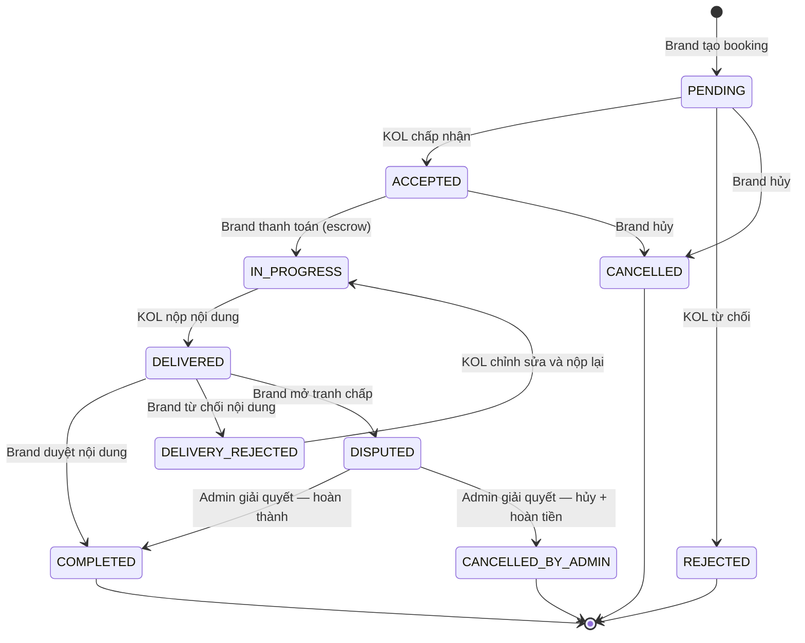

**Mô tả chi tiết từng trạng thái:**

| Trạng thái | Màu | Người thực hiện | Hành động tiếp theo |
|-----------|-----|-----------------|---------------------|
| PENDING | Amber | Brand | KOL: Accept/Reject; Brand: Cancel |
| ACCEPTED | Blue | KOL | Brand: Thanh toán |
| REJECTED | Red | — | Kết thúc |
| CANCELLED | Red | — | Kết thúc |
| IN_PROGRESS | Green | KOL | Nộp nội dung |
| DELIVERED | Teal | Brand | Duyệt / Từ chối / Tranh chấp |
| COMPLETED | Dark Green | — | Hai bên đánh giá nhau |
| DELIVERY_REJECTED | Amber-dark | KOL | Chỉnh sửa và nộp lại |
| DISPUTED | Orange | Admin | Giải quyết tranh chấp |
| CANCELLED_BY_ADMIN | Red | — | Kết thúc + hoàn tiền |

### 12.2 Luồng xác thực người dùng

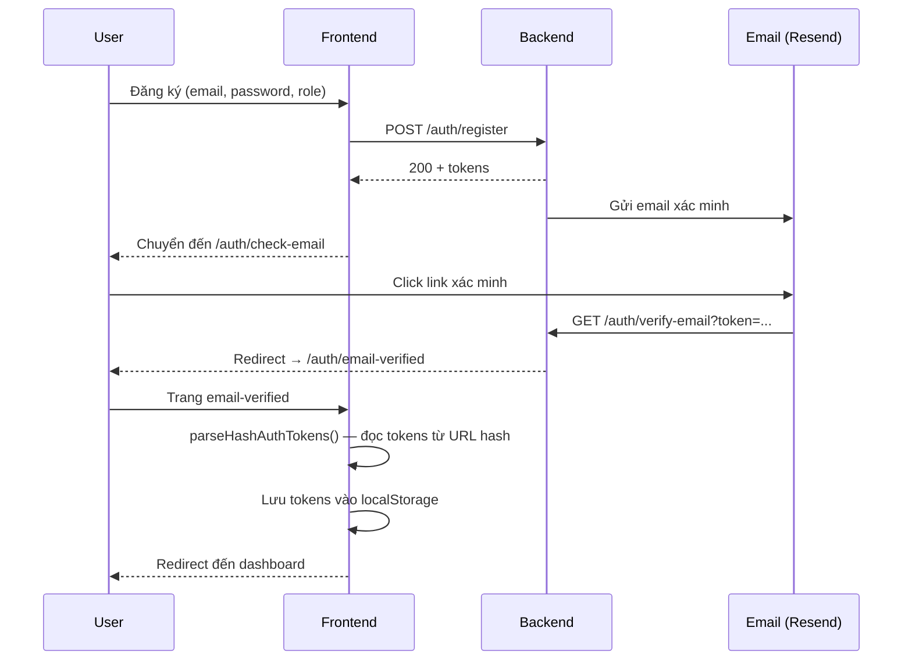

### 12.3 Luồng phê duyệt hồ sơ KOL

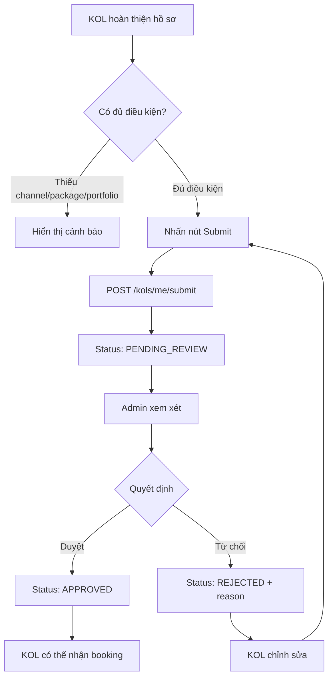

### 12.4 Luồng thanh toán

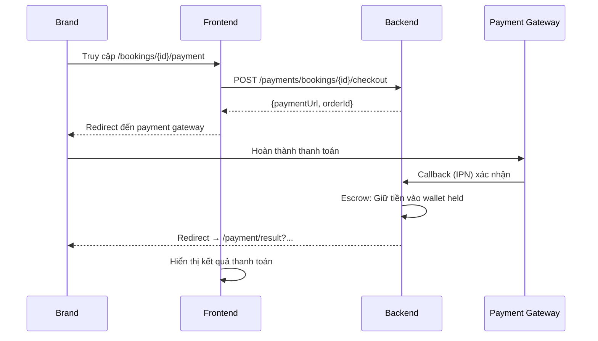

### 12.5 Luồng thanh toán ký quỹ (Escrow)

Hệ thống sử dụng mô hình **escrow** để bảo vệ cả hai phía:

1. Brand thanh toán → tiền vào `balance_held` của nền tảng.
2. KOL nộp nội dung → Brand duyệt.
3. Brand duyệt → tiền chuyển từ `balance_held` sang `balance_available` của KOL (sau khi trừ phí nền tảng).
4. Nếu tranh chấp và Admin quyết định hủy → tiền hoàn về Brand.

**Công thức tính hoa hồng:**

```
platform_fee_amount = budget × platform_fee_percent / 100
kol_net_amount = budget - platform_fee_amount
```

Tỷ lệ hoa hồng được lưu vào `platform_fee_percent` tại thời điểm booking để không ảnh hưởng bởi thay đổi chính sách sau này.

### 12.6 Kết luận chương

Luồng nghiệp vụ được thiết kế theo mô hình trạng thái (state machine) rõ ràng, cho phép kiểm soát chặt chẽ các chuyển đổi hợp lệ và ngăn ngừa thao tác sai. Cơ chế escrow đảm bảo quyền lợi tài chính cho cả Brand và KOL.

---

## 13. Danh sách API

### 13.1 Authentication API

| Method | Endpoint | Auth | Mô tả |
|--------|----------|------|-------|
| POST | `/auth/register` | — | Đăng ký tài khoản mới |
| POST | `/auth/login` | — | Đăng nhập, lấy JWT |
| POST | `/auth/logout` | Bearer | Đăng xuất, thu hồi refresh token |
| POST | `/auth/refresh` | — | Làm mới access token |
| POST | `/auth/verify-email` | — | Xác minh email bằng token |
| POST | `/auth/resend-verification` | — | Gửi lại email xác minh |
| POST | `/auth/forgot-password` | — | Yêu cầu reset mật khẩu |
| POST | `/auth/reset-password` | — | Đặt mật khẩu mới |
| GET | `/users/me` | Bearer | Lấy thông tin user hiện tại |

### 13.2 KOL API

| Method | Endpoint | Auth | Mô tả |
|--------|----------|------|-------|
| GET | `/kols/me` | Bearer (KOL) | Lấy hồ sơ KOL của tôi |
| PUT | `/kols/me` | Bearer (KOL) | Cập nhật hồ sơ |
| POST | `/kols/me/submit` | Bearer (KOL) | Nộp hồ sơ để duyệt |
| GET | `/kols/{slug}` | — | Hồ sơ công khai của KOL |
| GET | `/kols/search` | — | Tìm kiếm KOL với filters |
| GET | `/kols/featured` | — | Danh sách KOL nổi bật |
| GET | `/kols/me/channels` | Bearer (KOL) | Danh sách kênh |
| POST | `/kols/me/channels` | Bearer (KOL) | Thêm kênh mới |
| DELETE | `/kols/me/channels/{id}` | Bearer (KOL) | Xóa kênh |
| GET | `/kols/me/packages` | Bearer (KOL) | Danh sách gói |
| POST | `/kols/me/packages` | Bearer (KOL) | Thêm gói mới |
| DELETE | `/kols/me/packages/{id}` | Bearer (KOL) | Xóa gói |
| GET | `/kols/me/portfolio` | Bearer (KOL) | Danh sách portfolio |
| POST | `/kols/me/portfolio` | Bearer (KOL) | Thêm mục portfolio |
| DELETE | `/kols/me/portfolio/{id}` | Bearer (KOL) | Xóa mục portfolio |
| GET | `/kols/me/analytics/overview` | Bearer (KOL) | Tổng quan analytics |
| GET | `/kols/me/analytics/earnings` | Bearer (KOL) | Biểu đồ thu nhập |
| GET | `/kols/me/analytics/bookings` | Bearer (KOL) | Phân tích booking |

### 13.3 Brand API

| Method | Endpoint | Auth | Mô tả |
|--------|----------|------|-------|
| GET | `/brands/me` | Bearer (BRAND) | Hồ sơ Brand của tôi |
| PUT | `/brands/me` | Bearer (BRAND) | Cập nhật hồ sơ |
| POST | `/brands/me/submit` | Bearer (BRAND) | Nộp hồ sơ để duyệt |
| GET | `/brands/{id}` | — | Hồ sơ công khai Brand |
| GET | `/brands/{id}/products` | — | Sản phẩm/yêu cầu của Brand |
| POST | `/brands/me/favorites/{kolId}` | Bearer (BRAND) | Thêm KOL yêu thích |
| DELETE | `/brands/me/favorites/{kolId}` | Bearer (BRAND) | Xóa KOL yêu thích |
| GET | `/brands/me/favorites` | Bearer (BRAND) | Danh sách KOL yêu thích |
| GET | `/brands/me/analytics/overview` | Bearer (BRAND) | Tổng quan analytics |
| GET | `/brands/me/analytics/spending` | Bearer (BRAND) | Biểu đồ chi tiêu |

### 13.4 Booking API

| Method | Endpoint | Auth | Mô tả |
|--------|----------|------|-------|
| POST | `/bookings` | Bearer (BRAND) | Tạo booking mới |
| GET | `/bookings/{id}` | Bearer | Chi tiết booking |
| GET | `/bookings/me` | Bearer (BRAND) | Bookings tôi đã tạo |
| GET | `/bookings/incoming` | Bearer (KOL) | Bookings incoming |
| POST | `/bookings/{id}/cancel` | Bearer | Hủy booking |
| POST | `/bookings/{id}/accept` | Bearer (KOL) | Chấp nhận |
| POST | `/bookings/{id}/reject` | Bearer (KOL) | Từ chối |
| POST | `/bookings/{id}/deliverables` | Bearer (KOL) | Nộp nội dung |
| POST | `/bookings/{id}/approve-delivery` | Bearer (BRAND) | Duyệt nội dung |
| POST | `/bookings/{id}/reject-delivery` | Bearer (BRAND) | Từ chối nội dung |
| POST | `/bookings/{id}/request-revision` | Bearer (BRAND) | Yêu cầu chỉnh sửa |
| POST | `/bookings/{id}/dispute` | Bearer | Mở tranh chấp |
| GET | `/bookings/{id}/messages` | Bearer | Danh sách tin nhắn |
| POST | `/bookings/{id}/messages` | Bearer | Gửi tin nhắn |
| POST | `/bookings/{id}/reviews` | Bearer | Viết đánh giá |

### 13.5 Product API

| Method | Endpoint | Auth | Mô tả |
|--------|----------|------|-------|
| GET | `/products` | — | Duyệt danh sách yêu cầu |
| GET | `/products/{id}` | — | Chi tiết yêu cầu |
| POST | `/products` | Bearer (BRAND) | Đăng yêu cầu mới |
| PUT | `/products/{id}` | Bearer (BRAND) | Cập nhật yêu cầu |
| POST | `/products/{id}/close` | Bearer (BRAND) | Đóng yêu cầu |
| POST | `/products/{id}/reopen` | Bearer (BRAND) | Mở lại yêu cầu |
| DELETE | `/products/{id}` | Bearer (BRAND) | Xóa yêu cầu |
| GET | `/products/mine` | Bearer (BRAND) | Yêu cầu của tôi |
| POST | `/products/{id}/applications` | Bearer (KOL) | KOL ứng tuyển |
| GET | `/products/{id}/applications` | Bearer (BRAND) | Danh sách người ứng |
| GET | `/products/{id}/applications/top` | Bearer (BRAND) | Top ứng viên |

### 13.6 Wallet & Payment API

| Method | Endpoint | Auth | Mô tả |
|--------|----------|------|-------|
| GET | `/wallet/me` | Bearer | Số dư ví |
| GET | `/wallet/me/transactions` | Bearer | Lịch sử giao dịch |
| POST | `/payments/bookings/{id}/checkout` | Bearer (BRAND) | Khởi tạo thanh toán |
| GET | `/payments/bookings/{id}` | Bearer | Trạng thái thanh toán |

### 13.7 Notification API

| Method | Endpoint | Auth | Mô tả |
|--------|----------|------|-------|
| GET | `/notifications/me` | Bearer | Danh sách thông báo |
| GET | `/notifications/me/unread-count` | Bearer | Số thông báo chưa đọc |
| PATCH | `/notifications/{id}/read` | Bearer | Đánh dấu đã đọc |
| POST | `/notifications/me/read-all` | Bearer | Đánh dấu tất cả đã đọc |
| GET | `/notifications/stream` | Bearer (SSE) | SSE stream thông báo |

### 13.8 Admin API

| Method | Endpoint | Auth | Mô tả |
|--------|----------|------|-------|
| GET | `/admin/users` | Bearer (ADMIN) | Danh sách người dùng |
| POST | `/admin/users/{id}/ban` | Bearer (ADMIN) | Khóa tài khoản |
| POST | `/admin/users/{id}/unban` | Bearer (ADMIN) | Mở khóa |
| DELETE | `/admin/users/{id}` | Bearer (ADMIN) | Xóa tài khoản |
| POST | `/admin/users` | Bearer (ADMIN) | Tạo tài khoản mới |
| GET | `/admin/kols/pending` | Bearer (ADMIN) | KOL chờ duyệt |
| POST | `/admin/kols/{id}/approve` | Bearer (ADMIN) | Duyệt KOL |
| POST | `/admin/kols/{id}/reject` | Bearer (ADMIN) | Từ chối KOL |
| GET | `/admin/brands/pending` | Bearer (ADMIN) | Brand chờ duyệt |
| POST | `/admin/brands/{id}/approve` | Bearer (ADMIN) | Duyệt Brand |
| POST | `/admin/brands/{id}/reject` | Bearer (ADMIN) | Từ chối Brand |
| GET | `/admin/bookings` | Bearer (ADMIN) | Tất cả bookings |
| POST | `/admin/bookings/{id}/resolve` | Bearer (ADMIN) | Giải quyết tranh chấp |
| GET | `/admin/stats/overview` | Bearer (ADMIN) | Thống kê tổng quan |
| GET | `/admin/stats/bookings` | Bearer (ADMIN) | Thống kê booking |
| GET | `/admin/stats/revenue` | Bearer (ADMIN) | Thống kê doanh thu |
| GET | `/admin/stats/escrow` | Bearer (ADMIN) | Số liệu escrow |
| GET | `/admin/commission/summary` | Bearer (ADMIN) | Tổng quan hoa hồng |
| GET | `/admin/commission/transactions` | Bearer (ADMIN) | Lịch sử hoa hồng |

### 13.9 Next.js API Routes (nội bộ)

| Method | Endpoint | Mô tả |
|--------|----------|-------|
| POST | `/api/files/upload` | Upload file lên Cloudflare R2 |
| GET | `/api/tiktok-oembed?url=...` | Proxy lấy thông tin TikTok video |

---

## 14. Authentication & Authorization

### 14.1 Cơ chế xác thực

Hệ thống sử dụng **JWT (JSON Web Token)** với hai loại token:

| Token | Mục đích | Lưu trữ |
|-------|---------|---------|
| Access Token | Xác thực mỗi API request | `localStorage` (key: `kol_access_token`) |
| Refresh Token | Làm mới access token khi hết hạn | `localStorage` (key: `kol_refresh_token`) |

### 14.2 Luồng làm mới token tự động

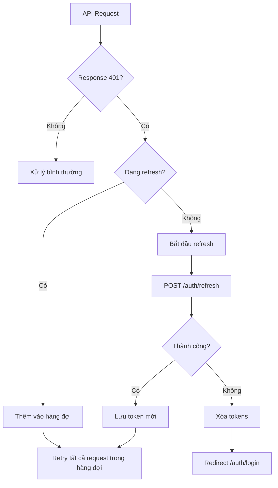

**Cơ chế hàng đợi (Queue):** Khi nhiều request cùng nhận 401 đồng thời, chỉ có 1 refresh request được gửi. Các request còn lại được thêm vào hàng đợi `refreshQueue` và sẽ được retry sau khi refresh hoàn tất — tránh tình trạng refresh đồng thời (race condition).

### 14.3 Phân quyền theo vai trò

| Tính năng | BRAND | KOL | ADMIN |
|---------|-------|-----|-------|
| Tạo booking | ✅ | ❌ | ❌ |
| Chấp nhận/từ chối booking | ❌ | ✅ | ❌ |
| Thanh toán booking | ✅ | ❌ | ❌ |
| Nộp nội dung | ❌ | ✅ | ❌ |
| Duyệt nội dung | ✅ | ❌ | ❌ |
| Đăng yêu cầu (Product) | ✅ | ❌ | ❌ |
| Ứng tuyển Product | ❌ | ✅ | ❌ |
| Quản lý hồ sơ KOL | ❌ | ✅ | ❌ |
| Duyệt hồ sơ KOL/Brand | ❌ | ❌ | ✅ |
| Xem trang Admin | ❌ | ❌ | ✅ |
| Giải quyết tranh chấp | ❌ | ❌ | ✅ |

### 14.4 Bảo vệ trang

Phân quyền được thực hiện ở cấp component, không phải middleware:

1. **`EmailVerificationGate`**: Bọc toàn bộ app — redirect về `/auth/login` nếu chưa đăng nhập.
2. **Role check trong page**: Mỗi page kiểm tra `user.role` và render nội dung/actions phù hợp.
3. **`BrandProfileGateBanner`**: Hiển thị cảnh báo khi hồ sơ Brand chưa được duyệt.

### 14.5 Kết luận chương

Cơ chế JWT với token refresh tự động mang lại trải nghiệm mượt mà. Việc lưu token trong localStorage (thay vì httpOnly cookie) là điểm cần cải thiện về bảo mật trong các phiên bản tương lai.

---

## 15. Validation Rules

### 15.1 Validation phía client (Zod + react-hook-form)

| Form | Field | Rule |
|------|-------|------|
| Đăng ký | Email | Định dạng email hợp lệ, required |
| Đăng ký | Password | Tối thiểu 8 ký tự, required |
| KOL Profile | Slug | Regex: `[a-z0-9]+(?:-[a-z0-9]+)*`, required |
| KOL Profile | Bio | 20–2000 ký tự |
| Booking | Budget | Số dương, required |
| Booking | Title | Required, không được rỗng |
| Package | Price | Số dương, required |
| Channel | Followers | Số nguyên dương |
| Channel | Engagement | 0–100 (%) |
| Product | Budget | Số dương |
| Review | Rating | 1–5 |
| Review | Comment | Required |

### 15.2 Validation upload file

| Loại file | Kích thước tối đa | MIME type cho phép |
|---------|-------------------|-------------------|
| Image | 5 MB | `image/jpeg`, `image/png`, `image/gif`, `image/webp` |
| Video | 100 MB | `video/mp4` |

Validation thực hiện tại `lib/uploads/validate.ts` trước khi gửi lên server.

### 15.3 Kết luận chương

Validation được thực hiện cả phía client (trải nghiệm tức thì) và phía server (bảo mật). Zod schema được dùng chung giữa form validation và API type checking.

---

## 16. Business Rules

### 16.1 Hồ sơ KOL

- Để submit hồ sơ cần có ít nhất: 1 kênh + 1 gói dịch vụ + 1 mục portfolio.
- Slug phải duy nhất và không thể thay đổi sau khi APPROVED.
- KOL chỉ nhận được booking khi hồ sơ ở trạng thái APPROVED.
- Sau khi bị REJECTED, KOL có thể chỉnh sửa và submit lại.

### 16.2 Hồ sơ Brand

- Brand cần hồ sơ APPROVED để tạo booking hoặc Product.
- `BrandProfileGateBanner` hiển thị cảnh báo khi hồ sơ ở DRAFT hoặc REJECTED.

### 16.3 Booking

- Chỉ Brand mới tạo được booking.
- Một booking chỉ có một KOL và một Brand.
- Thanh toán phải hoàn thành (escrow) trước khi chuyển sang IN_PROGRESS.
- KOL chỉ nộp được nội dung khi booking ở IN_PROGRESS.
- Brand có thể yêu cầu chỉnh sửa (revision) hoặc từ chối nội dung đã nộp.
- Sau khi COMPLETED, cả hai bên đều có thể viết đánh giá (mỗi chiều tối đa 1 đánh giá).
- Tỷ lệ hoa hồng được snapshot vào booking tại thời điểm tạo.

### 16.4 Product (Đăng tuyển)

- Chỉ Brand APPROVED mới đăng được Product.
- KOL ứng tuyển Product OPEN; mỗi KOL chỉ ứng tuyển 1 lần cho mỗi Product.
- Brand có thể shortlist, counter-offer, accept hoặc reject từng ứng viên.
- Khi Product CLOSED, không nhận thêm ứng tuyển.

### 16.5 Wallet & Escrow

- `balance_available`: Tiền có thể rút.
- `balance_held`: Tiền đang trong escrow (chờ hoàn thành booking).
- KOL chỉ rút được tiền từ `balance_available`.
- Khi booking COMPLETED, tiền escrow được giải phóng vào ví KOL (sau khi trừ phí).
- Khi booking CANCELLED_BY_ADMIN, tiền hoàn về ví Brand.

### 16.6 Kết luận chương

Các business rule được enforcement chủ yếu ở backend. Frontend thực hiện guard ở UI level để ngăn người dùng thao tác không hợp lệ và hiển thị thông báo phù hợp.

---

## 17. Queue / Background Jobs

> **Lưu ý:** Queue và background jobs được thực hiện hoàn toàn phía backend. Frontend không trực tiếp quản lý các tác vụ nền.

Dựa trên behavior quan sát được, backend có các tác vụ nền sau:

| Tác vụ | Mô tả |
|--------|-------|
| Gửi email xác minh | Sau khi đăng ký, gửi email ngay lập tức qua Resend |
| Gửi email reset mật khẩu | Sau khi request forgot-password |
| Gửi thông báo | Push notification khi có sự kiện booking |
| Escrow release | Giải phóng escrow khi booking COMPLETED |
| Hoa hồng | Ghi nhận fee vào commission ledger khi hoàn thành |

---

## 18. Event Flow

### 18.1 Hệ thống thông báo SSE

Frontend duy trì kết nối SSE đến `/notifications/stream` khi người dùng đăng nhập:

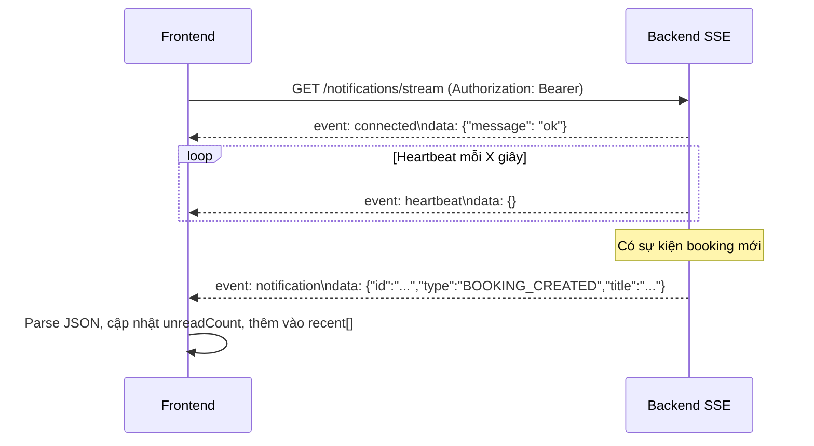

### 18.2 Xử lý mất kết nối SSE

Hook `use-sse.ts` tự động reconnect với exponential backoff:

| Lần thử | Độ trễ |
|---------|--------|
| 1 | 1 giây |
| 2 | 2 giây |
| 3 | 4 giây |
| N | min(2^(N-1), 30) giây |

Khi nhận 401, hook thực hiện token refresh rồi reconnect ngay lập tức.

### 18.3 Các loại thông báo

| NotificationType | Mô tả |
|-----------------|-------|
| BOOKING_CREATED | Brand tạo booking mới cho KOL |
| BOOKING_ACCEPTED | KOL chấp nhận booking |
| BOOKING_REJECTED | KOL từ chối booking |
| BOOKING_CANCELLED | Booking bị hủy |
| PAYMENT_SUCCESS | Thanh toán thành công |
| DELIVERABLE_SUBMITTED | KOL nộp nội dung |
| DELIVERY_APPROVED | Brand duyệt nội dung |
| DELIVERY_REJECTED | Brand từ chối nội dung |
| DELIVERY_REVISION_REQUESTED | Brand yêu cầu chỉnh sửa |
| DISPUTE_OPENED | Tranh chấp được mở |
| DISPUTE_RESOLVED | Tranh chấp được giải quyết |
| REVIEW_RECEIVED | Nhận được đánh giá |
| PROFILE_APPROVED | Hồ sơ được duyệt |
| PROFILE_REJECTED | Hồ sơ bị từ chối |
| APPLICATION_SHORTLISTED | Đơn ứng tuyển được shortlist |
| APPLICATION_ACCEPTED | Đơn ứng tuyển được chấp nhận |
| APPLICATION_REJECTED | Đơn ứng tuyển bị từ chối |
| WITHDRAWAL_APPROVED | Yêu cầu rút tiền được duyệt |
| WITHDRAWAL_REJECTED | Yêu cầu rút tiền bị từ chối |

---

## 19. Cache

### 19.1 Cache phía client

Hệ thống hiện tại không sử dụng thư viện cache tập trung (SWR, React Query). Dữ liệu được re-fetch mỗi khi component mount hoặc người dùng thực hiện thao tác.

### 19.2 Cache tại Next.js API Routes

Endpoint `/api/tiktok-oembed` có cache header:

```
Cache-Control: public, max-age=86400
```

Dữ liệu oEmbed của TikTok được cache 24 giờ tại Vercel CDN edge.

### 19.3 Cache chưa triển khai

- Kết quả tìm kiếm KOL: Chưa triển khai.
- Danh sách categories: Chưa triển khai (fetch mỗi lần mount).
- User profile: Chưa triển khai.

---

## 20. File Storage

### 20.1 Tổng quan

Hệ thống sử dụng **Cloudflare R2** (S3-compatible) để lưu trữ file do người dùng upload. R2 được cấu hình phía backend (không expose credentials ra frontend).

### 20.2 Luồng upload qua Next.js API Route

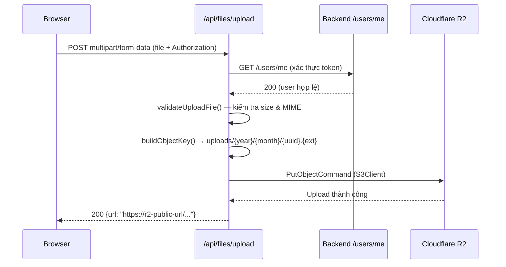

### 20.3 Cấu trúc object key

```
uploads/{year}/{month}/{uuid}.{extension}
```

Ví dụ: `uploads/2025/06/a1b2c3d4-e5f6-7890-abcd-ef1234567890.jpg`

### 20.4 Giới hạn upload

| Loại | Giới hạn kích thước | MIME type |
|------|--------------------|----|
| Ảnh | 5 MB | jpeg, png, gif, webp |
| Video | 100 MB | mp4 |

Next.js server action body size limit: **100 MB** (`next.config.mjs`).  
API Route timeout: **120 giây** (`maxDuration: 120`).

### 20.5 URL resolution

Hàm `resolveMediaUrl(url)` trong `lib/api/client.ts` chuyển đổi:
- `/uploads/path` → `{R2_PUBLIC_URL}/uploads/path` (absolute URL)
- URL tuyệt đối → giữ nguyên

---

## 21. Logging & Monitoring

### 21.1 Analytics

**Vercel Analytics** được tích hợp trong `app/layout.tsx`:

```tsx
import { Analytics } from "@vercel/analytics/react";
// <Analytics /> trong root layout
```

Theo dõi page views và Web Vitals tự động trên production.

### 21.2 Error logging

Không có hệ thống error tracking tập trung (Sentry, Datadog) được tích hợp. Lỗi API được bắt qua `try/catch` và hiển thị qua toast thông báo.

### 21.3 Network logging

Chưa triển khai — không có interceptor ghi log API calls.

---

## 22. Error Handling

### 22.1 Lớp API Error

```typescript
class ApiError extends Error {
  status: number;
  errorCode?: string;
  constructor(message: string, status: number, errorCode?: string)
}
```

### 22.2 Luồng xử lý lỗi

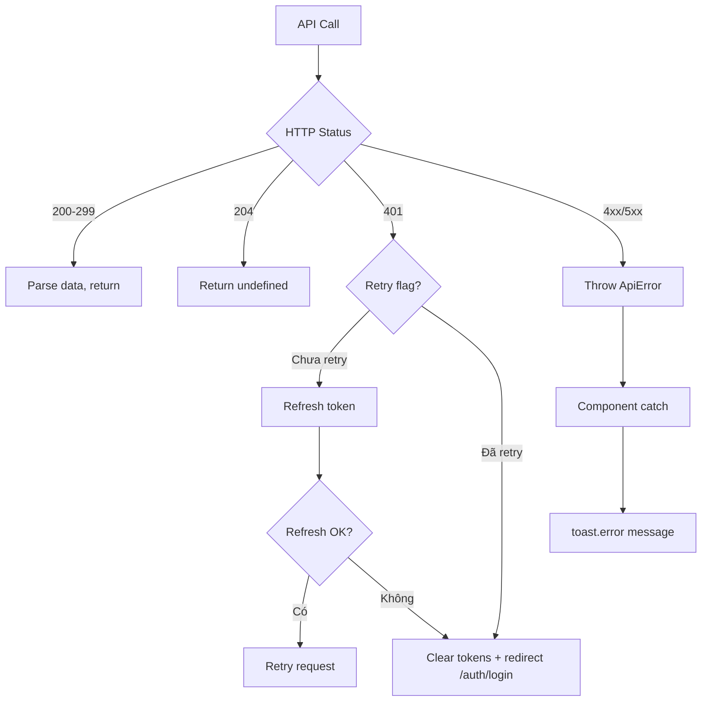

### 22.3 User-facing error messages

Lỗi hiển thị qua **sonner** toast notifications:

```typescript
try {
  await bookingApi.accept(id);
  toast.success("Đã chấp nhận booking");
} catch (error) {
  toast.error(error instanceof ApiError ? error.message : "Đã có lỗi xảy ra");
}
```

### 22.4 Kết luận chương

Error handling hiện tại đủ dùng cho production nhưng thiếu centralized error reporting. Các lỗi không mong đợi có thể bị bỏ sót nếu không có Sentry hoặc tương đương.

---

## 23. Security

### 23.1 Các biện pháp bảo mật đã triển khai

| Biện pháp | Mô tả |
|----------|-------|
| JWT Bearer auth | Mọi API call đều mang token trong header Authorization |
| Token refresh queue | Tránh race condition khi nhiều request cùng hết token |
| File validation | Kiểm tra MIME type và kích thước trước khi upload |
| Server-side R2 credentials | Credentials R2 chỉ ở Next.js API Route, không expose ra client |
| TikTok oEmbed proxy | Kiểm tra URL chứa "tiktok.com" trước khi proxy |
| URL hash tokens | Tokens trong email verify link dùng URL hash (#) — không gửi đến server |
| Input sanitization | Zod validation trên tất cả form input |

### 23.2 Điểm cần cải thiện

| Vấn đề | Mức độ | Đề xuất |
|--------|--------|---------|
| Token trong localStorage | Trung bình | Chuyển sang httpOnly cookie |
| Không có CSRF protection | Thấp | Thêm CSRF token cho các form quan trọng |
| Không có rate limiting phía client | Thấp | Debounce/throttle các call quan trọng |
| Không có Content Security Policy | Trung bình | Thêm CSP header trong next.config.mjs |

---

## 24. Cấu hình môi trường (.env)

### 24.1 Biến môi trường bắt buộc

| Biến | Phạm vi | Mô tả |
|------|---------|-------|
| `NEXT_PUBLIC_API_URL` | Client + Server | Base URL của backend API (không có dấu `/` cuối) |

### 24.2 Biến môi trường tùy chọn (server-side)

> Các biến R2 hiện được cấu hình phía backend. Nếu cần upload trực tiếp từ frontend server, cần bổ sung:

| Biến | Mô tả |
|------|-------|
| `R2_ACCOUNT_ID` | Cloudflare Account ID |
| `R2_ACCESS_KEY_ID` | R2 Access Key |
| `R2_SECRET_ACCESS_KEY` | R2 Secret Key |
| `R2_BUCKET_NAME` | Tên bucket |
| `R2_PUBLIC_URL` | URL công khai của bucket |

### 24.3 File `.env.local.example`

```bash
# Backend API base URL (no trailing slash)
# Local dev (Spring Boot on port 8081):
# NEXT_PUBLIC_API_URL=http://localhost:8081/api/v1
# Production:
NEXT_PUBLIC_API_URL=https://kol-booking-backend.onrender.com/api/v1
```

### 24.4 Lưu ý

- Không đặt `RESEND_API_KEY` ở frontend — email được xử lý hoàn toàn bởi backend.
- `NEXT_PUBLIC_*` variables được bundle vào client JavaScript — không đặt secret ở đây.

---

## 25. Hướng dẫn chạy project

### 25.1 Yêu cầu hệ thống

| Công cụ | Phiên bản tối thiểu |
|---------|---------------------|
| Node.js | 18.x trở lên |
| pnpm | 11.x trở lên |
| Git | Bất kỳ |

### 25.2 Các bước cài đặt

```bash
# 1. Clone repository
git clone <repository-url>
cd kol_booking-frontend

# 2. Cài đặt dependencies
pnpm install

# 3. Cấu hình môi trường
cp .env.local.example .env.local
# Chỉnh sửa .env.local với giá trị thực

# 4. Chạy development server
pnpm dev
```

Ứng dụng chạy tại: `http://localhost:3000`

### 25.3 Các lệnh thường dùng

| Lệnh | Mô tả |
|------|-------|
| `pnpm dev` | Chạy development server với hot reload |
| `pnpm build` | Build production |
| `pnpm start` | Chạy production build cục bộ |
| `pnpm lint` | Kiểm tra linting |
| `pnpm test` | Chạy test suite (Playwright) |

---

## 26. Build & Deploy

### 26.1 Quy trình build

```bash
pnpm build
```

Next.js thực hiện:
1. Type checking TypeScript (hiện tắt trong config — `ignoreBuildErrors: true`).
2. Compile và bundle JavaScript/CSS.
3. Static generation cho các trang không cần server.
4. Output tại `.next/`.

### 26.2 Cấu hình Next.js đặc biệt

```javascript
// next.config.mjs
{
  typescript: { ignoreBuildErrors: true },
  eslint: { ignoreDuringBuilds: true },
  serverActions: { bodySizeLimit: "100mb" },
  redirects: [
    { source: "/login", destination: "/auth/login", permanent: true },
    { source: "/api/v1/auth/:path*", destination: "/auth/login", permanent: false }
  ],
  rewrites: [
    { source: "/uploads/:path*", destination: `${API_URL}/files/uploads/:path*` }
  ]
}
```

### 26.3 Triển khai trên Vercel

Hệ thống triển khai tự động trên **Vercel** khi có push lên nhánh `main`:

1. Vercel phát hiện thay đổi → trigger build.
2. `pnpm build` chạy trong môi trường Vercel.
3. Output được deploy lên Vercel Edge Network.
4. URL production: `https://kol-booking-frontend.vercel.app`.

**Biến môi trường trên Vercel** được cấu hình trong Vercel Dashboard → Settings → Environment Variables.

### 26.4 Kết luận chương

Quy trình CI/CD hoàn toàn tự động qua Vercel, không cần cấu hình thêm. TypeScript errors bị bỏ qua trong build — đây là điểm cần khắc phục để đảm bảo chất lượng code.

---

## 27. Testing

### 27.1 Hiện trạng

Hệ thống có cài đặt **Playwright** trong `package.json` nhưng chưa có test case cụ thể nào được triển khai trong codebase hiện tại.

### 27.2 Loại test được đề xuất

| Loại | Framework | Mức độ ưu tiên |
|------|-----------|----------------|
| Unit test (utilities) | Jest + Testing Library | Cao |
| Component test | Playwright Component Test | Trung bình |
| E2E test (booking flow) | Playwright | Cao |
| API integration test | Playwright | Trung bình |

### 27.3 Các kịch bản test quan trọng

- Luồng đăng ký → xác minh email → đăng nhập.
- Luồng đặt lịch đầy đủ từ PENDING đến COMPLETED.
- Upload file: kiểm tra validation kích thước và loại.
- Refresh token: giả lập 401 và kiểm tra retry logic.

---

## 28. Coding Convention

### 28.1 TypeScript

- Strict mode bật (`"strict": true` trong tsconfig).
- Tránh dùng `any` — dùng kiểu cụ thể hoặc `unknown`.
- Tất cả props của component phải có type/interface.
- Enum được định nghĩa tập trung tại `lib/api/types.ts`.

### 28.2 Tổ chức file

- Mỗi page có đúng một file `page.tsx`.
- Component dùng chung đặt tại `components/`.
- Logic gọi API đặt tại `lib/api/`.
- Custom hooks đặt tại `hooks/`.
- Utilities và helpers đặt tại `lib/`.

### 28.3 Naming conventions

| Đối tượng | Convention | Ví dụ |
|---------|-----------|-------|
| Component | PascalCase | `BookingForm`, `KolCard` |
| File component | kebab-case.tsx | `booking-form.tsx` |
| Hook | camelCase bắt đầu `use` | `useNotifications` |
| File hook | kebab-case.ts | `use-notifications.ts` |
| API function | camelCase | `getMyBookings`, `submitDeliverable` |
| Enum | SCREAMING_SNAKE_CASE | `BookingStatus.IN_PROGRESS` |
| CSS class | kebab-case | `pin-input`, `btn-pin-primary` |

### 28.4 Import order

1. React và Next.js imports.
2. Third-party libraries.
3. Internal modules (`@/lib/`, `@/components/`, `@/hooks/`).
4. Type-only imports.

### 28.5 Kết luận chương

Convention được tuân thủ tương đối nhất quán trong codebase. Việc bật `ignoreBuildErrors` cho thấy một số file có TypeScript errors chưa được xử lý — cần khắc phục dần.

---

## 29. Performance Considerations

### 29.1 Tối ưu đã áp dụng

| Kỹ thuật | Mô tả |
|---------|-------|
| Next.js App Router | SSR cho trang có yêu cầu SEO |
| React Server Components | Giảm JavaScript bundle size |
| pnpm | Cài đặt nhanh, ít dung lượng |
| TikTok oEmbed caching | Cache 24h tại CDN edge |
| Exponential backoff SSE | Tránh flood server khi mất kết nối |
| Request queueing (401) | Tránh flood token refresh endpoint |
| Pagination | Tất cả danh sách lớn đều phân trang |

### 29.2 Điểm cần cải thiện

| Vấn đề | Ảnh hưởng | Đề xuất |
|--------|-----------|---------|
| Không có data caching client | Re-fetch nhiều khi điều hướng | Thêm SWR hoặc React Query |
| TypeScript `ignoreBuildErrors` | Che giấu lỗi type | Bật lại và sửa dần |
| Trang KOL Profile (1190 lines) | Khó maintain | Tách thành sub-components nhỏ hơn |
| LocalStorage token | Blocking render khi đọc | Cân nhắc dùng cookie |
| Image optimization tắt | Ảnh không được tối ưu | Bật Next.js Image optimization |

---

## 30. Những hạn chế hiện tại

| Hạn chế | Mô tả | Mức độ |
|---------|-------|--------|
| Không có test | Không có unit/e2e tests | Cao |
| TypeScript errors bị bỏ qua | `ignoreBuildErrors: true` | Cao |
| Token lưu trong localStorage | Dễ bị XSS tấn công | Trung bình |
| Không có client-side caching | Re-fetch dữ liệu thường xuyên | Trung bình |
| Route protection phía server | Không có middleware guard | Trung bình |
| Không có error tracking | Lỗi production không được ghi lại | Trung bình |
| Trang KOL Profile quá lớn | 1190 lines trong 1 file | Thấp |
| Không có skeleton loading | UI nhảy khi load dữ liệu | Thấp |
| Không có PWA | Không hoạt động offline | Thấp |
| VNPAY/MOMO chưa test đầy đủ | Chỉ có MOCK payment được test | Trung bình |

---

## 31. Hướng phát triển trong tương lai

| Tính năng | Mô tả | Độ ưu tiên |
|---------|-------|-----------|
| Chuyển token sang httpOnly cookie | Bảo mật JWT | Cao |
| Tích hợp SWR/React Query | Client-side caching, revalidation | Cao |
| Viết test suite với Playwright | Unit + E2E tests | Cao |
| Sửa TypeScript errors | Bật lại strict build | Cao |
| Thêm Sentry | Error monitoring production | Trung bình |
| Next.js Middleware auth guard | Route protection server-side | Trung bình |
| i18n | Hỗ trợ đa ngôn ngữ (Anh/Việt) | Trung bình |
| PWA | Hoạt động offline, push notification | Thấp |
| AI KOL matching | Tích hợp gợi ý thông minh | Trung bình |
| Video streaming | Preview video trực tiếp | Thấp |
| Export PDF | Xuất hóa đơn, báo cáo | Thấp |
| Dark mode | Chủ đề tối | Thấp |

---

## 32. Phụ lục

### 32.1 Thuật ngữ

| Thuật ngữ | Giải thích |
|---------|-----------|
| KOL | Key Opinion Leader — Người có tầm ảnh hưởng trên mạng xã hội |
| Brand | Nhãn hàng hoặc doanh nghiệp sử dụng dịch vụ KOL |
| Booking | Hợp đồng đặt lịch hợp tác giữa Brand và KOL |
| Deliverable | Nội dung mà KOL phải tạo ra và giao cho Brand |
| Escrow | Tiền đặt cọc được giữ bởi bên thứ ba (nền tảng) cho đến khi hoàn thành |
| JWT | JSON Web Token — Chuẩn xác thực phi trạng thái |
| SSE | Server-Sent Events — Công nghệ push one-way từ server |
| SSR | Server-Side Rendering — Render trang tại server |
| App Router | Hệ thống routing mới của Next.js 13+ dùng thư mục `app/` |
| R2 | Cloudflare R2 — Dịch vụ lưu trữ object tương thích S3 |
| oEmbed | Chuẩn nhúng nội dung từ các trang web bên ngoài |
| Profile Status | Trạng thái phê duyệt hồ sơ KOL/Brand: DRAFT → PENDING_REVIEW → APPROVED/REJECTED |
| Platform Fee | Hoa hồng nền tảng thu trên mỗi booking hoàn thành |
| Slug | Định danh URL thân thiện (vd: `nguyen-van-a`) |

### 32.2 Cấu trúc đối tượng Deliverables

Field `deliverables` trong Booking được lưu dưới dạng JSON string:

```json
[
  {
    "type": "VIDEO",
    "platform": "TIKTOK",
    "quantity": 2
  },
  {
    "type": "POST",
    "platform": "INSTAGRAM",
    "quantity": 3
  }
]
```

Hàm `parseBookingDeliverables()` trong `lib/bookings/deliverables.ts` parse chuỗi này và `formatDeliverableSpec()` format thành dạng hiển thị: _"Video · TikTok ×2"_.

### 32.3 Màu sắc trạng thái Booking

| Trạng thái | Màu Hex |
|-----------|---------|
| PENDING | `#f59e0b` (Amber) |
| ACCEPTED | `#2563eb` (Blue) |
| IN_PROGRESS | `#16a34a` (Green) |
| DELIVERED | `#0d9488` (Teal) |
| COMPLETED | `#15803d` (Dark Green) |
| REJECTED | `#dc2626` (Red) |
| CANCELLED | `#dc2626` (Red) |
| DISPUTED | `#ea580c` (Orange) |
| CANCELLED_BY_ADMIN | `#dc2626` (Red) |
| DELIVERY_REJECTED | `#b45309` (Amber Dark) |

### 32.4 Tham chiếu tài liệu kỹ thuật

| Tài liệu | Mô tả |
|---------|-------|
| [Next.js App Router Docs](https://nextjs.org/docs/app) | Tài liệu chính thức Next.js |
| [Radix UI Docs](https://www.radix-ui.com/primitives) | Tài liệu UI primitives |
| [Tailwind CSS v4 Docs](https://tailwindcss.com/docs) | Tài liệu Tailwind CSS |
| [Zod Docs](https://zod.dev) | Tài liệu schema validation |
| [react-hook-form Docs](https://react-hook-form.com) | Tài liệu form management |
| [Cloudflare R2 Docs](https://developers.cloudflare.com/r2) | Tài liệu Cloudflare R2 |
| [Recharts Docs](https://recharts.org) | Tài liệu charting library |

---

*Tài liệu này phản ánh hiện trạng hệ thống tại thời điểm soạn thảo. Mọi thay đổi sau thời điểm này cần được cập nhật vào tài liệu tương ứng.*
