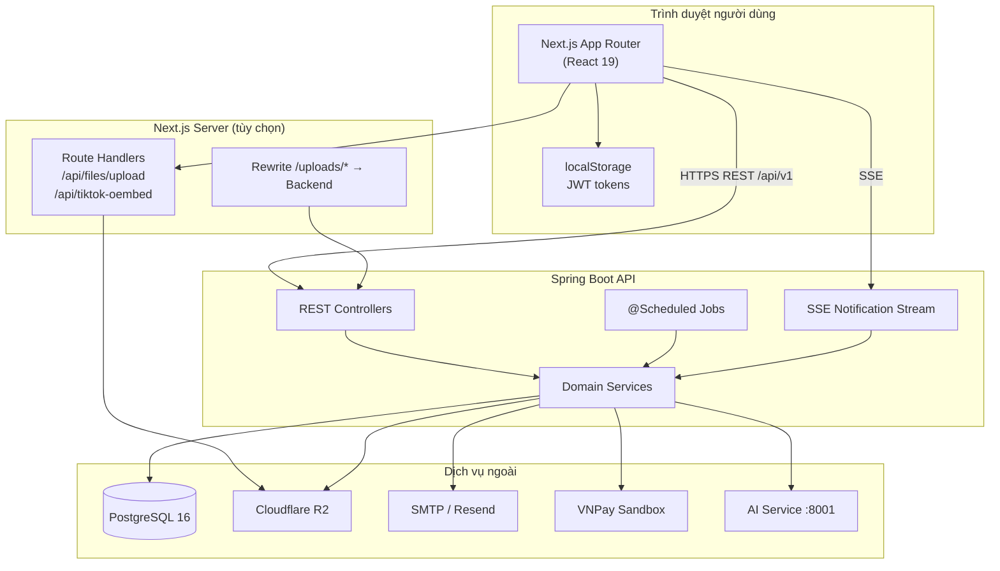
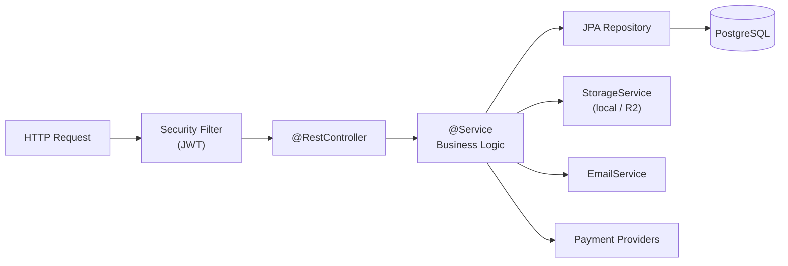
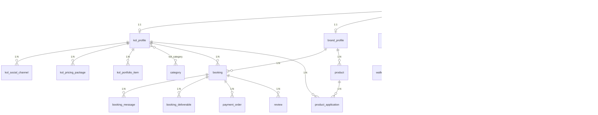
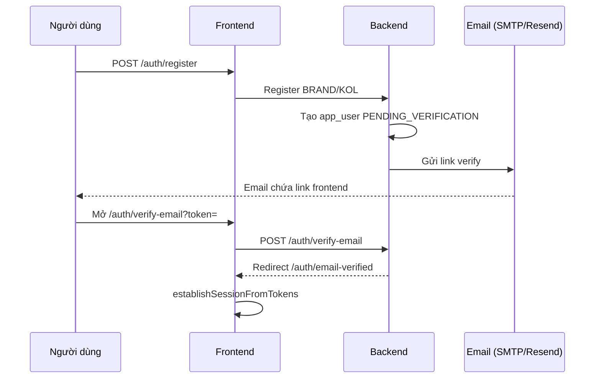
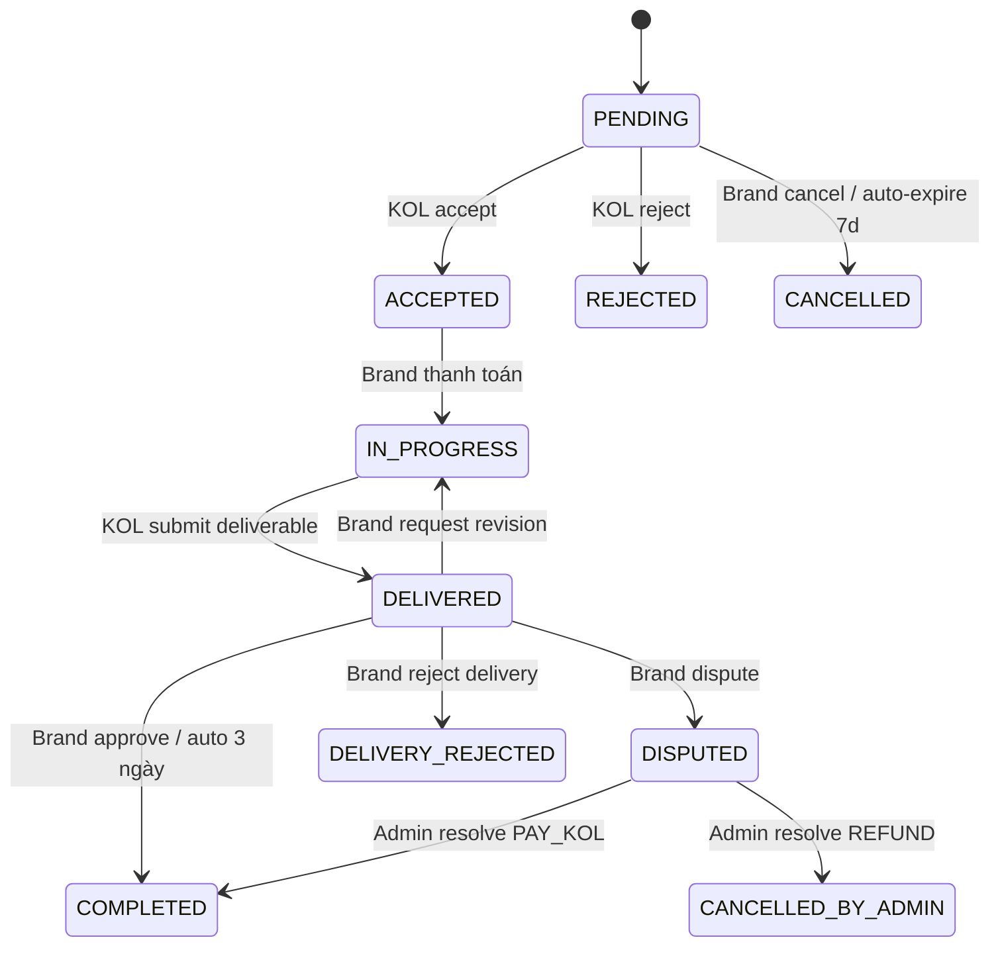
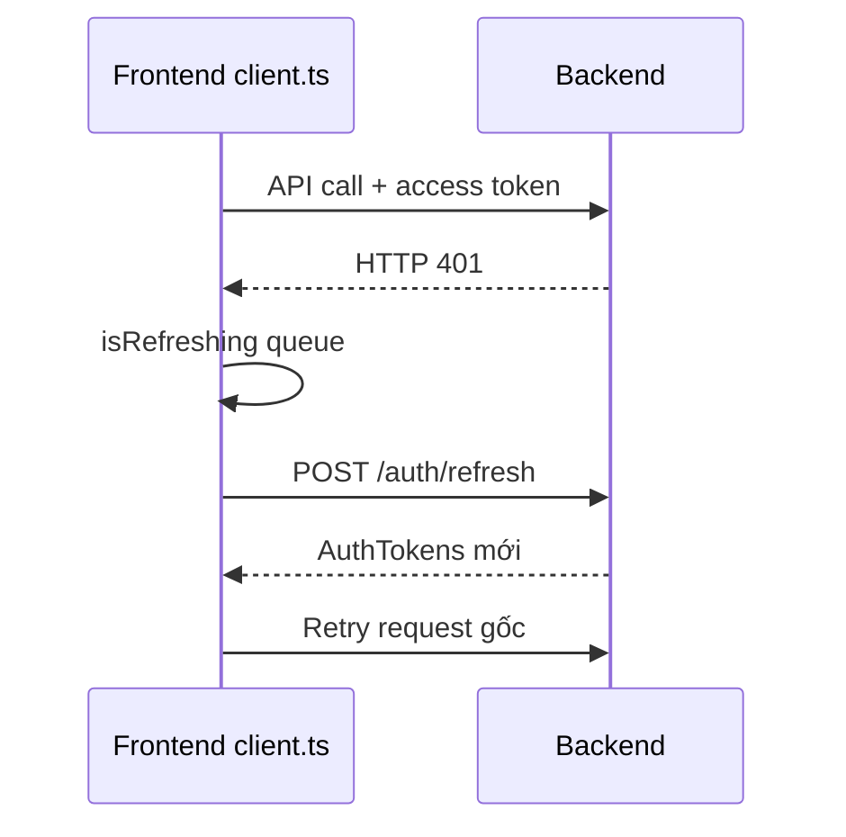
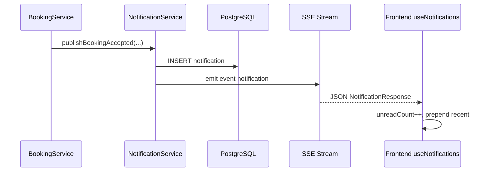
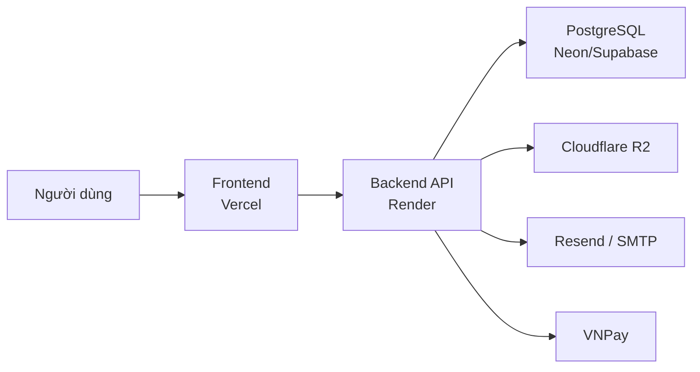

# Tài liệu thiết kế kỹ thuật hệ thống

**Phiên bản tài liệu:** 1.0  
**Ngày lập:** 18/06/2026  
**Phạm vi:** Project hiện tại (frontend Next.js + backend Spring Boot tích hợp qua REST API)

---

## Mục lục

1. [Giới thiệu hệ thống](#1-giới-thiệu-hệ-thống)
2. [Mục tiêu phát triển](#2-mục-tiêu-phát-triển)
3. [Phạm vi hệ thống](#3-phạm-vi-hệ-thống)
4. [Kiến trúc tổng thể](#4-kiến-trúc-tổng-thể)
5. [Công nghệ sử dụng (Tech Stack)](#5-công-nghệ-sử-dụng-tech-stack)
6. [Cấu trúc source code](#6-cấu-trúc-source-code)
7. [Kiến trúc Backend](#7-kiến-trúc-backend)
8. [Kiến trúc Frontend](#8-kiến-trúc-frontend)
9. [Thiết kế cơ sở dữ liệu](#9-thiết-kế-cơ-sở-dữ-liệu)
10. [Mô tả từng bảng dữ liệu](#10-mô-tả-từng-bảng-dữ-liệu)
11. [Quan hệ giữa các bảng](#11-quan-hệ-giữa-các-bảng)
12. [Luồng xử lý nghiệp vụ](#12-luồng-xử-lý-nghiệp-vụ)
13. [Danh sách API](#13-danh-sách-api)
14. [Authentication & Authorization](#14-authentication--authorization)
15. [Validation Rules](#15-validation-rules)
16. [Business Rules](#16-business-rules)
17. [Queue / Background Jobs](#17-queue--background-jobs)
18. [Event Flow](#18-event-flow)
19. [Cache](#19-cache)
20. [File Storage](#20-file-storage)
21. [Logging & Monitoring](#21-logging--monitoring)
22. [Error Handling](#22-error-handling)
23. [Security](#23-security)
24. [Cấu hình môi trường (.env)](#24-cấu-hình-môi-trường-env)
25. [Hướng dẫn chạy project](#25-hướng-dẫn-chạy-project)
26. [Build & Deploy](#26-build--deploy)
27. [Testing](#27-testing)
28. [Coding Convention](#28-coding-convention)
29. [Performance Considerations](#29-performance-considerations)
30. [Những hạn chế hiện tại](#30-những-hạn-chế-hiện-tại)
31. [Hướng phát triển trong tương lai](#31-hướng-phát-triển-trong-tương-lai)
32. [Phụ lục](#32-phụ-lục)

---

## 1. Giới thiệu hệ thống

### 1.1. Mô tả

Hệ thống là nền tảng kết nối **Brand (thương hiệu)** và **KOL (Key Opinion Leader / người sáng tạo nội dung)** nhằm hỗ trợ tìm kiếm, đặt lịch hợp tác, quản lý chiến dịch, thanh toán qua ví escrow, đánh giá và vận hành back-office cho quản trị viên.

Project hiện tại được triển khai theo mô hình **tách lớp**:

- **Frontend:** Ứng dụng web Next.js 16 (App Router), giao diện người dùng, client API, xác thực JWT phía trình duyệt.
- **Backend:** Dịch vụ REST Spring Boot 3.5 (Java 21), xử lý nghiệp vụ, bảo mật, thanh toán, lưu trữ file, gửi email, lịch tự động.
- **Cơ sở dữ liệu:** PostgreSQL 16, quản lý schema bằng Flyway migration.

Người dùng cuối tương tác qua trình duyệt; mọi dữ liệu nghiệp vụ được đồng bộ qua API `/api/v1`.

### 1.2. Vai trò người dùng

| Vai trò | Mã enum | Mô tả ngắn |
|---------|---------|------------|
| Brand | `BRAND` | Tìm KOL, tạo booking, thanh toán, duyệt deliverable, đăng tin tuyển KOL |
| KOL | `KOL` | Quản lý hồ sơ, nhận/từ chối booking, giao nội dung, rút tiền |
| Admin | `ADMIN` | Duyệt hồ sơ, quản lý user, giải quyết tranh chấp, thống kê, hoa hồng |

### 1.3. Kết luận chương

Hệ thống là marketplace B2B cho hợp tác Brand–KOL, vận hành trên kiến trúc client–server với backend là nguồn sự thật nghiệp vụ và PostgreSQL là kho dữ liệu chính.

---

## 2. Mục tiêu phát triển

### 2.1. Mục tiêu nghiệp vụ

- Cung cấp công cụ **khám phá và lọc KOL** theo danh mục, nền tảng, follower, giá, đánh giá.
- Chuẩn hóa **quy trình booking** từ yêu cầu → chấp nhận → thanh toán → thực hiện → nghiệm thu → hoàn tất.
- Bảo vệ hai bên bằng **ví escrow** (giữ tiền đến khi Brand nghiệm thu).
- Thu **phí nền tảng** (mặc định 10%) và hỗ trợ admin theo dõi doanh thu hoa hồng.
- Cho phép Brand **đăng tin tuyển KOL** (product posting) và KOL **ứng tuyển** kèm đàm phán giá.
- Hỗ trợ **trợ lý AI** gợi ý KOL phù hợp (tích hợp qua backend).

### 2.2. Mục tiêu kỹ thuật

- API REST có envelope thống nhất, tài liệu OpenAPI/Swagger.
- Xác thực JWT stateless, refresh token, phân quyền theo role.
- Schema DB versioned qua Flyway; không dùng `ddl-auto=update` ở production.
- Frontend TypeScript-first, module API tách biệt, UI responsive.

### 2.3. Kết luận chương

Mục tiêu tập trung vào marketplace booking KOL có escrow, minh bạch phí nền tảng và khả năng mở rộng qua module sản phẩm/ứng tuyển và AI assistant.

---

## 3. Phạm vi hệ thống

### 3.1. Trong phạm vi (đã triển khai)

| Khối chức năng | Trạng thái |
|----------------|------------|
| Đăng ký / đăng nhập / xác minh email / quên mật khẩu | ✅ Frontend + Backend |
| Hồ sơ KOL & Brand (draft → submit → admin duyệt) | ✅ |
| Tìm kiếm KOL công khai, yêu thích KOL | ✅ |
| Booking lifecycle đầy đủ (kể cả revision, dispute, delivery reject) | ✅ |
| Thanh toán booking (MOCK, VNPay; Stripe enum có trên API) | ✅ Backend; Frontend có trang payment |
| Ví, escrow, rút tiền, admin duyệt rút | ✅ |
| Reviews hai chiều sau COMPLETED | ✅ |
| Thông báo in-app + SSE stream | ✅ |
| Chat tin nhắn trong booking | ✅ |
| Admin panel (user, duyệt profile, booking, category, commission, withdrawal) | ✅ |
| Brand đăng tin / KOL ứng tuyển / đàm phán giá | ✅ |
| Upload file (backend local/R2; frontend có route R2 tùy chọn) | ✅ |
| AI Assistant chat | ✅ Frontend page + Backend proxy |
| Subscription / Plans API | ✅ Backend; **Chưa có UI subscription trên frontend** |

### 3.2. Ngoài phạm vi / Chưa triển khai

| Hạng mục | Ghi chú |
|----------|---------|
| Ứng dụng mobile native | Không có trong project hiện tại |
| Real-time chat WebSocket riêng | Dùng REST + polling/SSE notification |
| Redis cache layer | Không có trong project hiện tại |
| Message queue (RabbitMQ, Kafka) | Không có trong project hiện tại |
| Trang `/pricing` subscription UI | Không có route trong frontend hiện tại |
| File `scripts/01_create_tables.sql` | Schema Supabase cũ, **không phản ánh** DB production |

### 3.3. Kết luận chương

Phạm vi bao phủ toàn bộ vòng đời hợp tác Brand–KOL trên web; các thành phần hạ tầng nâng cao (cache, queue, mobile) chưa nằm trong project hiện tại.

---

## 4. Kiến trúc tổng thể

### 4.1. Sơ đồ kiến trúc logic



### 4.2. Luồng triển khai môi trường

| Thành phần | Dev local | Production (theo cấu hình hiện có) |
|------------|-----------|--------------------------------------|
| Frontend | `localhost:3000` | Vercel (`NEXT_PUBLIC_API_URL` trỏ Render backend) |
| Backend | `localhost:8081` | Render (`kol-booking-backend.onrender.com`) |
| Database | PostgreSQL (Neon/Supabase pooler) | PostgreSQL managed |
| Analytics | Tắt | Vercel Analytics (production) |

### 4.3. Kết luận chương

Kiến trúc 3 tầng rõ ràng: SPA/SSR frontend, API backend monolith, PostgreSQL persistence; tích hợp dịch vụ bên thứ ba cho email, storage và thanh toán.

---

## 5. Công nghệ sử dụng (Tech Stack)

### 5.1. Frontend (project hiện tại — repository chính)

| Lớp | Công nghệ | Phiên bản (package.json) |
|-----|-----------|--------------------------|
| Framework | Next.js (App Router) | 16.2.0 |
| UI | React | 19.2.4 |
| Ngôn ngữ | TypeScript | 5.7.3 |
| CSS | Tailwind CSS | 4.2.0 |
| Component | Radix UI, shadcn/ui pattern | Nhiều package @radix-ui/* |
| Form | React Hook Form (UI wrapper), validation thủ công | 7.54.1 |
| Schema lib | Zod (dependency) | 3.24.1 — **chưa thấy sử dụng rộng rãi trong code** |
| Chart | Recharts | 2.15.0 |
| Toast | Sonner | 1.7.1 |
| Icon | Lucide React | 0.564.0 |
| HTTP | Fetch API wrapper tùy chỉnh | `lib/api/client.ts` |
| Analytics | @vercel/analytics | 1.6.1 |
| E2E (devDep) | @playwright/test | 1.60.0 — **chưa có file test** |
| Package manager | pnpm | 11.5.0 |

### 5.2. Backend (dịch vụ liên kết — không nằm trong repo frontend)

| Lớp | Công nghệ |
|-----|-----------|
| Framework | Spring Boot 3.5.13 |
| JVM | Java 21 |
| ORM | Spring Data JPA / Hibernate |
| Migration | Flyway |
| DB | PostgreSQL 16 |
| Auth | JWT (access + refresh) |
| API docs | SpringDoc OpenAPI 3 |
| Storage | Local filesystem hoặc Cloudflare R2 (AWS SDK S3 client) |
| Email | JavaMail (SMTP) hoặc Resend API |
| Payment | MOCK, VNPay (Stripe/Momo enum có trên API) |

### 5.3. Kết luận chương

Stack hiện đại TypeScript/React phía client và Spring Boot phía server; PostgreSQL là SGBD duy nhất được sử dụng trong hệ thống production.

---

## 6. Cấu trúc source code

### 6.1. Cây thư mục frontend (rút gọn)

```
project/
├── app/                    # Next.js App Router — pages & layouts
│   ├── admin/              # Khu vực quản trị (role ADMIN)
│   ├── auth/               # Login, register, verify email, ...
│   ├── bookings/           # Quản lý & chi tiết booking
│   ├── kol-dashboard/      # Dashboard KOL
│   ├── products/           # Brand đăng tin / KOL browse
│   ├── applications/       # Ứng tuyển của KOL
│   ├── api/                # Route handlers Next.js
│   └── ...
├── components/             # UI components (header, forms, shadcn/ui)
├── contexts/               # AuthContext
├── hooks/                  # use-notifications, use-sse, ...
├── lib/
│   ├── api/                # 15+ module gọi REST API
│   ├── bookings/           # Label, màu, commission helpers
│   ├── uploads/            # validateUploadFile
│   └── storage/            # uploadToR2 (server-side)
├── scripts/                # SQL/Python hỗ trợ seed (dev ops)
├── docs/                   # Tài liệu
├── public/                 # Static assets
├── next.config.mjs
├── package.json
└── tsconfig.json
```

### 6.2. Module API frontend (`lib/api/`)

| Module | File | Mục đích |
|--------|------|----------|
| Core | `client.ts`, `types.ts` | Fetch wrapper, refresh token, types |
| Auth | `auth.ts` | Register, login, refresh, verify, reset password |
| KOL | `kol.ts` | Profile, search, channels, packages, portfolio |
| Brand | `brand.ts` | Profile, favorites |
| Bookings | `bookings.ts` | CRUD booking, deliverable, messages |
| Products | `products.ts` | Brand postings |
| Applications | `applications.ts` | Ứng tuyển, counter-offer |
| Payments | `payments.ts` | Checkout booking |
| Wallet | `wallet.ts` | Số dư, lịch sử |
| Withdrawals | `withdrawals.ts` | Yêu cầu rút |
| Reviews | `reviews.ts` | Tạo/sửa/xem review |
| Notifications | `notifications.ts` | Danh sách, đọc |
| Categories | `categories.ts` | Cây danh mục |
| Files | `files.ts` | Upload qua backend |
| Admin | `admin.ts` | Stats, duyệt, ban, dispute |
| AI | `ai-assistant.ts` | Chat gợi ý KOL |

### 6.3. Kết luận chương

Frontend tổ chức theo App Router với tách biệt rõ `app/` (route), `components/` (UI), `lib/api/` (hợp đồng backend).

---

## 7. Kiến trúc Backend

### 7.1. Mô hình phân lớp



### 7.2. Đặc điểm kỹ thuật

- **Base path:** `/api/v1`
- **Response envelope:** `ApiResponse<T>` — mọi endpoint trả `{ success, data, message, errorCode }`
- **Phân trang:** `PageResponse<T>` — `currentPage` 0-based, mặc định `size=20`
- **Bảo mật:** Stateless JWT; public endpoints whitelist trong Security config
- **Schema:** Flyway migrations `V1`–`V38+`; Hibernate `ddl-auto=validate`
- **OpenAPI:** `/swagger-ui.html`, `/v3/api-docs`
- **Health:** `/actuator/health`, `/actuator/info`

### 7.3. Domain chính (backend)

| Package logic | Trách nhiệm |
|---------------|-------------|
| auth | JWT, refresh token, verification token, email |
| kol / brand | Profile, duyệt admin |
| booking | State machine, deliverable, messages |
| payment / wallet | Escrow, checkout, ledger |
| product | Brand posting & application |
| notification | DB notification + SSE stream |
| admin | Stats, audit log, dispute resolution |
| ai-assistant | Proxy tới AI microservice |

### 7.4. Kết luận chương

Backend là monolith Spring Boot theo chuẩn layered architecture, đóng vai trò orchestrator cho nghiệp vụ, thanh toán và tích hợp dịch vụ ngoài.

---

## 8. Kiến trúc Frontend

### 8.1. Mô hình render & routing

- **App Router** Next.js 16: mỗi thư mục `app/<route>/page.tsx` là một màn hình.
- **Client Components** (`'use client'`) cho tương tác: form, auth, fetch API.
- **Root layout** bọc `AuthProvider` + `EmailVerificationGate` + Sonner toaster.

### 8.2. Quản lý trạng thái

| Concern | Cơ chế |
|---------|--------|
| Auth user | React Context (`AuthContext`) |
| API data | `useState` + `useEffect` / fetch trực tiếp qua `lib/api/*` |
| Notifications | Hook `useNotifications` + SSE `useSse` |
| Theme | CSS variables (DESIGN.md — Pinterest-inspired tokens) |

### 8.3. Bảo vệ route

| Khu vực | Cơ chế |
|---------|--------|
| Admin | `app/admin/layout.tsx` — redirect nếu role ≠ ADMIN |
| Email chưa verify | `EmailVerificationGate` — chuyển `/auth/check-email` |
| API 401 | `lib/api/client.ts` — refresh token, redirect `/auth/login` |

### 8.4. Danh sách route chính (frontend hiện tại)

| Nhóm | Route ví dụ |
|------|---------------|
| Public | `/`, `/discover`, `/kols`, `/kol/[id]`, `/brand/[id]`, `/products` |
| Auth | `/auth/login`, `/auth/register`, `/auth/forgot-password`, `/reset-password`, `/auth/verify-email` |
| Brand | `/dashboard`, `/profile`, `/bookings`, `/products/manage`, `/brand-analytics`, `/ai-assistant` |
| KOL | `/kol-dashboard/[id]`, `/kol-dashboard/profile`, `/kol-dashboard/wallet`, `/applications/mine` |
| Chung (đăng nhập) | `/wallet`, `/notifications`, `/reviews`, `/payment/result` |
| Admin | `/admin`, `/admin/users`, `/admin/kols/review`, `/admin/brands/review`, `/admin/bookings`, `/admin/categories`, `/admin/commission`, `/admin/withdrawals` |

### 8.5. Next.js Route Handlers

| Route | Mục đích |
|-------|----------|
| `POST /api/files/upload` | Upload trực tiếp lên Cloudflare R2 (khi cấu hình `R2_*` env) |
| `GET /api/tiktok-oembed` | Proxy oEmbed TikTok cho portfolio player |

### 8.6. Kết luận chương

Frontend là SPA-heavy trên Next.js App Router, giao tiếp backend qua module API typed; phân quyền thực hiện ở layout và interceptor HTTP.

---

## 9. Thiết kế cơ sở dữ liệu

### 9.1. Nguyên tắc thiết kế

- **SGBD:** PostgreSQL 16
- **Quản lý schema:** Flyway (`db/migration/V*.sql`) trên backend
- **Khóa chính:** `BIGSERIAL` cho hầu hết bảng
- **Thời gian:** `TIMESTAMPTZ`, timezone JDBC = UTC
- **Tiền tệ:** `NUMERIC(15,2)` / `NUMERIC(18,2)`, currency mặc định `VND`
- **Enum:** Lưu dạng `VARCHAR` (Java `EnumType.STRING`)

### 9.2. Lưu ý về file SQL legacy

File `scripts/01_create_tables.sql` trong repo frontend mô tả schema Supabase cũ (`users`, `client_profiles`, RLS policies) — **không được backend Flyway sử dụng**. Schema chính thức nằm ở backend migrations.

### 9.3. Sơ đồ ER tổng quan



### 9.4. Kết luận chương

CSDL quan hệ chuẩn hóa quanh `app_user`, profile KOL/Brand, booking-centric workflow và sổ cái ví; schema được version control qua Flyway.

---

## 10. Mô tả từng bảng dữ liệu

### 10.1. Nhóm xác thực & người dùng

#### `app_user`

| Cột | Kiểu | Mô tả |
|-----|------|-------|
| id | BIGSERIAL PK | ID người dùng |
| email | VARCHAR(255) UNIQUE | Email đăng nhập |
| password_hash | VARCHAR(255) | Mật khẩu bcrypt |
| role | VARCHAR(32) | `ADMIN`, `BRAND`, `KOL` |
| status | VARCHAR(32) | `PENDING_VERIFICATION`, `ACTIVE`, `INACTIVE`, `BANNED` |
| email_verified | BOOLEAN | Đã xác minh email |
| created_at, updated_at | TIMESTAMPTZ | Audit |

#### `refresh_token`

| Cột | Mô tả |
|-----|-------|
| user_id | FK → app_user |
| token | Refresh token (unique) |
| expires_at | Hết hạn |
| revoked | Thu hồi khi logout |

#### `verification_token`

| Cột | Mô tả |
|-----|-------|
| user_id | FK → app_user |
| token | Token xác minh / reset password |
| purpose | Mục đích (email verify, password reset) |
| expires_at, used_at | TTL và trạng thái sử dụng |

### 10.2. Nhóm hồ sơ

#### `kol_profile`

Hồ sơ công khai KOL: display_name, slug (unique), avatar, cover, bio, gender, date_of_birth, city, country, status (`DRAFT` → `PENDING_REVIEW` → `APPROVED`/`REJECTED`), avg_rating, review_count, reject_reason.

#### `kol_social_channel`

Kênh MXH: platform, url, username, follower_count, engagement_rate, verified.

#### `kol_pricing_package`

Gói giá: type (`POST`, `VIDEO`, …), platform, price (VND), description.

#### `kol_portfolio_item`

Portfolio: title, media_url, media_type (`IMAGE`/`VIDEO`), campaign_name.

#### `brand_profile`

Hồ sơ Brand: company_name, tax_code, industry, logo_url, website, contact_name, contact_phone, address, bio, country, status, reject_reason.

#### `brand_favorite`

PK composite (brand_profile_id, kol_profile_id) — KOL yêu thích của Brand.

#### `kol_category`

Bảng nối many-to-many KOL ↔ category.

### 10.3. Nhóm booking

#### `booking`

| Cột quan trọng | Mô tả |
|----------------|-------|
| brand_profile_id, kol_profile_id | FK hai bên |
| campaign_title, campaign_brief | Thông tin chiến dịch |
| deliverables | JSONB / TEXT (deliverables mô tả) |
| budget | Ngân sách Brand trả |
| platform_fee_percent/amount, kol_net_amount | Snapshot hoa hồng (V26+) |
| brand_company_name, kol_display_name | Snapshot tên (V37+) |
| revision_feedback, revision_requested_at | Yêu cầu chỉnh sửa (V38+) |
| status | State machine (xem mục 16) |
| invoice_url | URL hóa đơn |

#### `booking_message`

Tin nhắn nội bộ booking: sender_user_id, content, attachment_url.

#### `booking_deliverable`

Deliverable theo loại/platform: submitted_url, submitted_at, status, brand_feedback.

#### `booking_status_history`

Lịch sử chuyển trạng thái: from_status, to_status, changed_by_user, note.

### 10.4. Nhóm thanh toán & ví

#### `wallet`

balance_available, balance_held, currency (`VND`); CHECK ≥ 0.

#### `wallet_transaction`

Ledger: type (`DEPOSIT`, `HOLD`, `RELEASE`, `WITHDRAW`, `REFUND`, `FEE`), amount, balance_after, booking_id, external_ref (unique partial).

#### `payment_order`

Đơn thanh toán booking: provider, status, payment_url, external_ref, paid_at.

#### `withdraw_request`

Yêu cầu rút của KOL (và có thể Brand theo API): bank_*, status, reject_reason, processed_at.

### 10.5. Nhóm đánh giá & thông báo

#### `review`

UNIQUE (booking_id, direction); rating 1–5; direction `BRAND_TO_KOL` / `KOL_TO_BRAND`.

#### `notification`

type (enum NotificationType), title, message, link, read_at.

#### `admin_audit_log`

Hành động admin: action, target_type, target_id, payload.

### 10.6. Nhóm danh mục & gói dịch vụ

#### `category`

Cây phân cấp: name, slug (unique), parent_id.

#### `plan` / `subscription`

Gói đăng ký Brand/KOL: code, price, duration_days, target_role; subscription gắn user_id, plan_id, status, expires_at.

### 10.7. Nhóm sản phẩm / ứng tuyển

#### `product`

Brand đăng tin: title, description, image_url, budget, category_id, required_platform, min_followers, slots, status (`OPEN`/`CLOSED`), deadline, application_count.

#### `product_application`

Ứng tuyển KOL: message, proposed_price, brand_counter_price (V36+), status, booking_id (khi accept), reject_reason; UNIQUE (product_id, kol_profile_id).

### 10.8. Kết luận chương

Tổng cộng **24+ bảng** chính phục vụ auth, profile, booking, tài chính, đánh giá, thông báo, subscription và marketplace ứng tuyển.

---

## 11. Quan hệ giữa các bảng

### 11.1. Cardinality chính

| Quan hệ | Loại | Ghi chú |
|---------|------|---------|
| app_user ↔ kol_profile | 1:1 | user_id UNIQUE |
| app_user ↔ brand_profile | 1:1 | user_id UNIQUE |
| kol_profile ↔ kol_social_channel | 1:N | Cascade delete |
| brand_profile ↔ booking | 1:N | RESTRICT delete khi có booking |
| booking ↔ payment_order | 1:N | Một booking có thể nhiều lần checkout |
| booking ↔ review | 1:N | Tối đa 2 review/booking (2 direction) |
| product ↔ product_application | 1:N | Một KOL một application/product |
| product_application → booking | N:1 | Tạo booking khi accept |

### 11.2. Ràng buộc toàn vẹn đáng chú ý

- Xóa user cascade refresh_token, notification; profile cascade các entity con.
- `wallet_transaction.external_ref` unique khi NOT NULL — idempotency thanh toán.
- `review`: UNIQUE (booking_id, direction) — mỗi chiều một review.

### 11.3. Kết luận chương

Quan hệ xoay quanh booking và app_user; snapshot tên/hoa hồng trên booking đảm bảo báo cáo lịch sử ổn định.

---

## 12. Luồng xử lý nghiệp vụ

### 12.1. Luồng đăng ký & xác minh email



### 12.2. State machine Booking



### 12.3. Luồng escrow ví

1. Brand checkout → `payment_order` PAID → booking `IN_PROGRESS`.
2. Tiền **HOLD** vào escrow (`balance_held`).
3. Brand approve delivery → booking `COMPLETED` → **RELEASE** cho KOL (trừ `FEE` cho platform wallet).
4. Brand reject delivery → `DELIVERY_REJECTED` → **REFUND** về ví Brand.

### 12.4. Luồng Product → Application → Booking

1. Brand tạo `product` (OPEN).
2. KOL `POST /products/{id}/applications`.
3. Brand shortlist / counter-offer / accept.
4. Accept → backend tạo booking `PENDING` và liên kết `product_application.booking_id`.

### 12.5. Kết luận chương

Nghiệp vụ cốt lõi là booking state machine kết hợp escrow; luồng phụ product/application mở rộng kênh tuyển KOL chủ động.

---

## 13. Danh sách API

**Base URL:** `{HOST}/api/v1`  
**Envelope:** `ApiResponse<T>` | **Phân trang:** `PageResponse<T>`

### 13.1. Auth (public trừ logout cần token tùy implementation)

| Method | Path | Mô tả |
|--------|------|-------|
| POST | `/auth/register` | Đăng ký |
| POST | `/auth/login` | Đăng nhập |
| POST | `/auth/refresh` | Refresh token |
| POST | `/auth/logout` | Thu hồi refresh token |
| POST | `/auth/verify-email` | Xác minh email |
| POST | `/auth/resend-verification` | Gửi lại email verify |
| POST | `/auth/forgot-password` | Quên mật khẩu |
| POST | `/auth/reset-password` | Đặt lại mật khẩu |

### 13.2. User

| Method | Path | Role |
|--------|------|------|
| GET | `/users/me` | Authenticated |
| PATCH | `/users/me/deactivate` | Authenticated |
| DELETE | `/users/me` | Authenticated (soft delete) |

### 13.3. KOL

| Method | Path | Ghi chú |
|--------|------|---------|
| GET | `/kols/search` | Public; BRAND + JWT → `isFavorite` |
| GET | `/kols/featured` | Public |
| GET | `/kols/{slug}` | Public |
| GET | `/kols/{id}/reviews` | Public |
| GET/PUT | `/kols/me` | KOL |
| POST | `/kols/me/submit` | KOL |
| POST/DELETE | `/kols/me/channels`, `/packages`, `/portfolio` | KOL |

### 13.4. Brand

| Method | Path | Role |
|--------|------|------|
| GET/PUT | `/brands/me` | BRAND |
| POST | `/brands/me/submit` | BRAND |
| POST/DELETE/GET | `/brands/me/favorites/{kolId}`, `/favorites` | BRAND |

### 13.5. Bookings

| Method | Path | Role |
|--------|------|------|
| POST | `/bookings` | BRAND |
| GET | `/bookings/me`, `/bookings/incoming` | BRAND / KOL |
| GET | `/bookings/{id}` | Participant |
| POST | `/bookings/{id}/accept`, `/reject`, `/cancel` | KOL / BRAND |
| POST | `/bookings/{id}/deliverables` | KOL |
| POST | `/bookings/{id}/approve-delivery`, `/reject-delivery`, `/request-revision`, `/dispute` | BRAND |
| POST/GET | `/bookings/{id}/messages` | BRAND, KOL |

### 13.6. Reviews

| Method | Path |
|--------|------|
| POST | `/bookings/{bookingId}/reviews` |
| PUT | `/reviews/{reviewId}` |
| GET | `/users/{userId}/reviews`, `/kols/{kolId}/reviews` |

### 13.7. Payments & Wallet

| Method | Path |
|--------|------|
| POST | `/payments/bookings/{bookingId}/checkout` |
| GET | `/payments/bookings/{bookingId}` |
| POST/GET | `/payments/webhook/{provider}` |
| GET | `/wallet/me`, `/wallet/me/transactions` |

### 13.8. Withdrawals

| Method | Path | Role |
|--------|------|------|
| POST | `/withdraws` | KOL (và user có quyền rút) |
| GET | `/withdraws/me` | KOL |
| GET/POST | `/withdraws/admin/*` | ADMIN |

### 13.9. Notifications

| Method | Path |
|--------|------|
| GET | `/notifications/me`, `/notifications/me/unread-count` |
| GET (SSE) | `/notifications/stream` |
| PATCH | `/notifications/{id}/read` |
| POST | `/notifications/me/read-all` |

### 13.10. Categories, Files, Plans, Subscriptions

| Method | Path |
|--------|------|
| GET | `/categories` |
| POST | `/files/upload` (multipart `file`) |
| GET | `/plans`, `/plans/{code}` |
| GET/POST | `/subscriptions/me`, `/checkout`, `/{id}/cancel` |

### 13.11. Products & Applications

| Method | Path |
|--------|------|
| GET | `/products`, `/products/{id}` |
| POST/PUT/DELETE | `/products`, `/products/{id}`, `/close`, `/reopen` |
| GET | `/products/mine` |
| POST | `/products/{id}/applications` |
| GET | `/products/{id}/applications`, `/applications/top` |
| GET | `/applications/mine` |
| POST | `/applications/{id}/withdraw`, `/shortlist`, `/accept`, `/reject`, `/counter-offer`, `/accept-counter`, `/reject-counter` |

### 13.12. Admin

| Method | Path |
|--------|------|
| GET | `/admin/users`, `/admin/kols`, `/admin/brands` |
| POST | `/admin/kols/{id}/approve`, `/reject`, tương tự brands |
| POST | `/admin/users/{id}/ban`, `/unban` |
| GET | `/admin/bookings` |
| POST | `/admin/bookings/{id}/resolve-dispute` |
| GET | `/admin/stats/overview`, `/bookings`, `/top-kols`, `/revenue`, `/commission`, `/escrow-metrics` |
| GET | `/admin/audit-logs` |
| POST/PUT/DELETE | `/admin/categories` |

### 13.13. AI Assistant

| Method | Path |
|--------|------|
| GET | `/ai-assistant/health` |
| POST | `/ai-assistant/chat` |

### 13.14. Health & tài liệu

| Method | Path |
|--------|------|
| GET | `/actuator/health`, `/actuator/info` |
| GET | `/swagger-ui.html`, `/v3/api-docs` |

> **Nguồn sự thật chi tiết:** OpenAPI `/v3/api-docs` trên backend; file `API_SUMMARY.md` trong repo frontend là bản tóm lược nghiệp vụ.

### 13.15. Kết luận chương

Hệ thống expose **60+ endpoint** REST versioned `/api/v1`, nhóm theo domain; frontend mirror qua 15 module TypeScript.

---

## 14. Authentication & Authorization

### 14.1. Cơ chế xác thực

| Thành phần | Chi tiết |
|------------|----------|
| Loại | JWT Bearer (stateless, **không** dùng cookie session) |
| Access token TTL | 900 giây (15 phút) — `app.jwt.access-token-ttl-seconds` |
| Refresh token TTL | 604800 giây (7 ngày) |
| Lưu trữ frontend | `localStorage`: `kol_access_token`, `kol_refresh_token` |
| Header | `Authorization: Bearer <accessToken>` |

### 14.2. Luồng refresh token



### 14.3. Phân quyền (Authorization)

| HTTP | errorCode | Ý nghĩa |
|------|-----------|---------|
| 401 | `UNAUTHORIZED` | Chưa đăng nhập / token invalid |
| 403 | `FORBIDDEN` | Sai role (vd KOL gọi API BRAND) |

**Public endpoints (không JWT):** `/auth/**`, GET categories, KOL search/featured/detail/reviews, plans, payment webhooks, swagger, actuator health, `/uploads/**`.

**Guard frontend:**

- Admin layout kiểm tra `user.role === 'ADMIN'`.
- `EmailVerificationGate` chặn user chưa verify (trừ whitelist auth routes).

### 14.4. Kết luận chương

Auth JWT two-token với refresh queue phía frontend; authorization kết hợp backend role guard và frontend layout gate.

---

## 15. Validation Rules

### 15.1. Backend

- Bean Validation (`@Valid`) trên DTO request — lỗi trả `VALIDATION_FAILED` (400).
- File upload backend: ảnh tối đa **5 MB**; video **100 MB** (`FileStorageService` / `application.properties` multipart cap).
- Review rating: CHECK 1–5 trên DB.
- Product slots: CHECK ≥ 1.

### 15.2. Frontend (đã triển khai trong code)

| Ngữ cảnh | Rule |
|----------|------|
| Register password | ≥ 8 ký tự, 1 chữ hoa, 1 số, 1 ký tự đặc biệt |
| Reset password | ≥ 8 ký tự |
| Profile Brand | phone regex `^0\d{9,10}$`; max length name 100, address 255, bio 500 |
| Upload client | JPEG/PNG/GIF/WEBP ≤ 5MB; MP4 ≤ 100MB (`lib/uploads/validate.ts`) |
| Booking form | campaign title/brief required; budget > 0; endDate ≥ startDate |
| Content URL | `isValidContentUrl`: http(s) hoặc `/uploads/` path |

### 15.3. Zod / React Hook Form

- Package **Zod** và **React Hook Form** có trong dependencies; phần lớn form hiện dùng **validation thủ công** trong component (register, profile, booking).
- Component `components/ui/form.tsx` hỗ trợ pattern shadcn + RHF cho form phức tạp.

### 15.4. Kết luận chương

Validation phân tầng: backend là authority; frontend bổ sung UX rule và giới hạn upload trước khi gửi API.

---

## 16. Business Rules

### 16.1. Phí nền tảng (Commission)

- Mặc định **10%** (`app.platform.fee-percent=10`).
- Snapshot trên booking: `platform_fee_percent`, `platform_fee_amount`, `kol_net_amount` (migration V26).
- KOL nhận thực = budget − fee; platform ghi `FEE` vào `wallet_transaction`.

### 16.2. Escrow

- Thanh toán thành công → tiền **HOLD** (không spend được ngay).
- `COMPLETED` → **RELEASE** cho KOL + **FEE** cho platform wallet (user_id hệ thống).
- `DELIVERY_REJECTED` / admin refund → **REFUND** Brand.

### 16.3. Profile visibility

- Chỉ KOL/Brand status `APPROVED` hiển thị công khai trên search.
- Flow: `DRAFT`/`REJECTED` → submit → `PENDING_REVIEW` → admin approve/reject.

### 16.4. Booking actions theo state

| State | Brand | KOL |
|-------|-------|-----|
| PENDING | cancel | accept / reject |
| ACCEPTED | checkout | — |
| IN_PROGRESS | — | submit deliverable |
| DELIVERED | approve / reject / revision / dispute | — |
| COMPLETED | review | review |

### 16.5. Tự động hóa (scheduler)

- PENDING quá **7 ngày** → auto `CANCELLED`.
- DELIVERED quá **3 ngày** không phản hồi Brand → auto `COMPLETED`.

### 16.6. Product application

- Một KOL chỉ một application/product (UNIQUE constraint).
- Accept application → tạo booking liên kết.
- Counter-offer: Brand đề xuất giá → KOL accept-counter hoặc reject-counter.

### 16.7. Review

- Chỉ sau booking `COMPLETED`.
- UNIQUE theo `(booking_id, direction)` — tối đa một review mỗi chiều.

### 16.8. Kết luận chương

Business rules xoay quanh escrow 10%, duyệt profile, state machine booking và ràng buộc review/application.

---

## 17. Queue / Background Jobs

### 17.1. Cơ chế

Hệ thống **không** sử dụng message broker (RabbitMQ/Kafka). Jobs chạy nội bộ Spring `@Scheduled`.

### 17.2. Danh sách job

| Job | Class | Lịch | Chức năng |
|-----|-------|------|-----------|
| Expire stale PENDING bookings | `BookingScheduler.expireStalePendingBookings` | Mỗi giờ (`0 0 * * * *`) | PENDING > 7 ngày → CANCELLED |
| Auto-complete DELIVERED | `BookingScheduler.autoCompleteDeliveredBookings` | 03:00 hàng ngày | DELIVERED > 3 ngày → COMPLETED |
| SSE heartbeat | `SseHeartbeatScheduler` | fixedDelay 25s | Giữ kết nối notification stream |

### 17.3. Kết luận chương

Background processing giới hạn ở scheduled tasks trong backend; không có hàng đợi async độc lập trong project hiện tại.

---

## 18. Event Flow

### 18.1. Mô hình sự kiện

Hệ thống **không** triển khai event bus phân tán. "Sự kiện" được xử lý đồng bộ trong service layer và phản ánh qua:

1. **Bản ghi `notification`** trong DB.
2. **SSE push** tới client đang kết nối (`/notifications/stream`, event `notification`).
3. **`booking_status_history`** cho audit booking.

### 18.2. Sơ đồ thông báo



### 18.3. NotificationType (enum)

`BOOKING_CREATED`, `BOOKING_ACCEPTED`, `BOOKING_REJECTED`, `BOOKING_CANCELLED`, `BOOKING_IN_PROGRESS`, `DELIVERABLE_SUBMITTED`, `DELIVERY_REVISION_REQUESTED`, `BOOKING_COMPLETED`, `BOOKING_DISPUTED`, `PAYMENT_SUCCESS`, `REVIEW_RECEIVED`, `WITHDRAW_APPROVED`, `WITHDRAW_REJECTED`, `PROFILE_APPROVED`, `PROFILE_REJECTED`, `NEW_MESSAGE`, `PRODUCT_APPLICATION_RECEIVED`, `APPLICATION_*`, ...

### 18.4. Kết luận chương

Event flow thực tế là notification-driven (DB + SSE), không có Kafka/event sourcing.

---

## 19. Cache

### 19.1. Hiện trạng

| Lớp | Cache |
|-----|-------|
| Backend | **Không** cấu hình Redis/Spring Cache trong `application.properties` |
| Frontend | Không dùng SWR/React Query; fetch trực tiếp |
| HTTP | `Cache-Control: no-cache` trên SSE; API REST mặc định no-store |
| Next.js | `fetch` auth check upload: `cache: 'no-store'` |

### 19.2. Kết luận chương

**Không có layer cache phân tán** trong project hiện tại; mọi đọc dữ liệu đi thẳng tới API/DB.

---

## 20. File Storage

### 20.1. Backend storage providers

| Provider | Config | Mô tả |
|----------|--------|-------|
| `local` (dev default) | `app.storage.local.root=uploads` | File lưu filesystem, serve qua `/uploads/**` |
| `r2` (prod) | `CF_R2_*` env | Cloudflare R2 qua AWS S3 SDK |

**API upload:** `POST /api/v1/files/upload` — multipart field `file` → `{ url }`.

### 20.2. Frontend storage

| Cách | Chi tiết |
|------|----------|
| Qua backend (mặc định) | `filesApi.upload()` → backend `/files/upload` |
| Route handler R2 | `POST /api/files/upload` — upload trực tiếp R2 nếu `R2_*` env trên **frontend** được cấu hình |
| Rewrite | `next.config.mjs` rewrite `/uploads/:path*` → backend origin |
| Hiển thị URL | `resolveMediaUrl()` — prepend origin cho path `/uploads/...` |

### 20.3. Giới hạn & định dạng

| Loại | Max size | MIME |
|------|----------|------|
| Ảnh | 5 MB | JPEG, PNG, GIF, WEBP |
| Video | 100 MB | MP4 |

### 20.4. Kết luận chương

File storage abstracted qua backend provider local/R2; frontend hỗ trợ thêm route R2 tùy chọn và proxy uploads cho hiển thị.

---

## 21. Logging & Monitoring

### 21.1. Backend

- **Logging:** SLF4J/Logback (Spring Boot default) — `log.info/warn/error` trong services (email, R2, scheduler).
- **Actuator:** `/actuator/health`, `/actuator/info` exposed.
- **Swagger:** API observability cho developer.

### 21.2. Frontend

- **Console:** `console.error` trên route upload R2 lỗi.
- **Vercel Analytics:** bật khi `NODE_ENV === 'production'` trong root layout.
- **Không có** Sentry/Datadog tích hợp trong project hiện tại.

### 21.3. Kết luận chương

Monitoring ở mức health check + application log; chưa có APM hoặc centralized log aggregation trong repo.

---

## 22. Error Handling

### 22.1. Backend

- `@RestControllerAdvice` bọc mọi exception → `ApiResponse.error`.
- **Không** trả stack trace cho client.
- `errorCode` chuẩn: `VALIDATION_FAILED`, `RESOURCE_NOT_FOUND`, `BUSINESS_ERROR`, `UNAUTHORIZED`, `FORBIDDEN`, `INTERNAL_ERROR`, `EMAIL_ALREADY_EXISTS`, `INVALID_CREDENTIALS`, `ACCOUNT_INACTIVE`, `ACCOUNT_BANNED`, `TOKEN_*`, ...

### 22.2. Frontend

```typescript
// lib/api/client.ts
class ApiError extends Error {
  constructor(public status: number, public errorCode: string | null, message: string)
}
```

- Interceptor 401 → refresh → redirect login.
- UI: hiển thị `message` từ server (toast Sonner / inline error).
- Pattern `errMsg(e, fallback)` trong nhiều page.

### 22.3. Kết luận chương

Error handling thống nhất qua envelope API; frontend ưu tiên `errorCode` + `message` từ backend.

---

## 23. Security

### 23.1. Biện pháp đã triển khai

| Biện pháp | Chi tiết |
|-----------|----------|
| Mật khẩu | bcrypt hash trên backend |
| JWT secret | Env `APP_JWT_SECRET` (dev có default — **phải đổi prod**) |
| CORS | Whitelist origins (`app.cors.allowed-origins`) |
| Refresh token revocation | Flag `revoked` khi logout |
| Verification token | TTL email 24h, reset password 2h |
| Payment webhook | HMAC/mock secret (`app.payment.mock.secret`) |
| Upload auth | Backend `/files/upload` yêu cầu JWT; frontend R2 route verify `/users/me` |
| Admin actions | Audit log `admin_audit_log` |
| Email dev mode | `app.mail.dev-mode` — fallback khi gửi mail thất bại |

### 23.2. Rủi ro cần lưu ý

- JWT trong **localStorage** — dễ bị XSS; cần sanitize input nghiêm ngặt.
- `typescript.ignoreBuildErrors: true` trong `next.config.mjs` — có thể che lỗi type unsafe.
- Secrets backend **không** đặt trong frontend `.env` (Resend, R2 backend keys).

### 23.3. Kết luận chương

Security baseline đủ cho ứng dụng web JWT standard; production cần harden secret, HTTPS và xem xét httpOnly cookie nếu nâng cấp.

---

## 24. Cấu hình môi trường (.env)

### 24.1. Frontend (`.env.local`)

| Biến | Bắt buộc | Mô tả |
|------|----------|-------|
| `NEXT_PUBLIC_API_URL` | Có | Base API, vd `http://localhost:8081/api/v1` hoặc URL Render production |

**Tùy chọn (route `/api/files/upload` R2 trực tiếp):**

| Biến | Mô tả |
|------|-------|
| `R2_ACCOUNT_ID` | Cloudflare account |
| `R2_ACCESS_KEY_ID` | R2 access key |
| `R2_SECRET_ACCESS_KEY` | R2 secret |
| `R2_BUCKET_NAME` | Bucket name |
| `R2_PUBLIC_URL` | Public URL bucket |

> File `.env.local.example` ghi rõ: upload mặc định qua backend; **không** cần `R2_*` ở frontend nếu backend đã cấu hình R2.

### 24.2. Backend (`.env` — dịch vụ liên kết)

| Biến | Mô tả |
|------|-------|
| `SPRING_DATASOURCE_URL/USERNAME/PASSWORD` | PostgreSQL JDBC |
| `APP_JWT_SECRET` | Secret ký JWT |
| `APP_FRONTEND_URL` | URL frontend cho link email |
| `APP_URL` | URL backend public |
| `APP_MAIL_PROVIDER`, `RESEND_API_KEY`, `SPRING_MAIL_*` | Email |
| `APP_STORAGE_PROVIDER`, `CF_R2_*` | File storage |
| `VNPAY_*` | Cổng VNPay |
| `APP_AI_SERVICE_BASE_URL` | AI microservice |
| `APP_CORS_ALLOWED_ORIGINS` | CORS bổ sung |

### 24.3. Kết luận chương

Cấu hình tách biệt frontend (chỉ public API URL + optional R2) và backend (secrets & integrations).

---

## 25. Hướng dẫn chạy project

### 25.1. Yêu cầu

- Node.js 18+
- pnpm 11+
- Backend Spring Boot + PostgreSQL đang chạy (port **8081** mặc định backend dev)

### 25.2. Frontend

```bash
# Trong thư mục project frontend
pnpm install
cp .env.local.example .env.local
# Chỉnh NEXT_PUBLIC_API_URL=http://localhost:8081/api/v1
pnpm dev
```

Truy cập: `http://localhost:3000`

### 25.3. Backend (dịch vụ liên kết)

```bash
# Trong repo backend (ngoài repo frontend)
./gradlew bootRun
# Swagger: http://localhost:8081/swagger-ui.html
```

Cấu hình DB qua biến `SPRING_DATASOURCE_*`; Flyway tự migrate.

### 25.4. Tài khoản seed (dev)

- Password chung seed: `password123`
- Brand/KOL seed: email `*@seed.local` (xem `API_SUMMARY.md`)
- Admin: **không** seed sẵn — cập nhật SQL `UPDATE app_user SET role = 'ADMIN' WHERE email = '...'`

### 25.5. Kết luận chương

Môi trường dev cần chạy song song frontend :3000 và backend :8081 với PostgreSQL đã migrate.

---

## 26. Build & Deploy

### 26.1. Frontend

```bash
pnpm build    # next build
pnpm start    # next start (production server)
```

**Cấu hình build:**

- `next.config.mjs`: `images.unoptimized: true`, rewrites uploads, redirects auth email links.
- `typescript.ignoreBuildErrors: true` — build bỏ qua lỗi TS (cần lưu ý chất lượng).

**Deploy:** Vercel (theo `.env.local.example` production URL).

### 26.2. Backend

- Deploy Render (`kol-booking-backend.onrender.com` trong example env).
- Profile `prod`: storage R2, datasource pooler Supabase/Neon (giới hạn connection — tránh chạy local + redeploy đồng thời).

### 26.3. CI/CD

**Không có** pipeline CI/CD trong repo frontend hiện tại (TODO: GitHub Actions / Vercel auto nếu có trên remote).

### 26.4. Kết luận chương

Build/deploy tiêu chuẩn Next.js + Spring Boot jar; production frontend Vercel, backend Render.

---

## 27. Testing

### 27.1. Hiện trạng

| Loại | Trạng thái |
|------|------------|
| Unit test frontend | **Không có** trong project hiện tại |
| E2E Playwright | Dependency có (`@playwright/test`); **không có** file `*.spec.ts` / config |
| Backend test | **Không đánh giá** trong repo frontend (TODO: kiểm tra repo backend) |
| Test upload thủ công | Thư mục `test-upload-files/` (ảnh/video mẫu) |

### 27.2. Kiểm thử thủ công được ghi nhận

- Luồng auth, discover, booking, admin — qua seed data Flyway V8–V17+.
- Payment MOCK: GET mock webhook URL sau checkout.

### 27.3. Kết luận chương

Testing tự động **chưa triển khai** trên frontend; chủ yếu manual QA với dữ liệu seed.

---

## 28. Coding Convention

### 28.1. TypeScript / React

- **Strict mode** bật trong `tsconfig.json`.
- Path alias `@/*` → root project.
- Client components đánh dấu `'use client'`.
- API modules: một file một domain, export object `xxxApi`.
- Types tập trung `lib/api/types.ts` mirror backend DTO.

### 28.2. Đặt tên

| Loại | Quy ước |
|------|---------|
| Component file | kebab-case `.tsx` (`booking-form.tsx`) |
| Route folder | kebab-case (`kol-dashboard/`) |
| Enum API | UPPER_SNAKE (`BOOKING_CREATED`) |
| Token localStorage | snake_case keys (`kol_access_token`) |

### 28.3. UI / Design

- Design tokens theo `DESIGN.md` (Pinterest-inspired): `pin-card`, `surface-soft`, `pin-red`, font Inter/Manrope.
- Component UI base: shadcn/ui pattern trong `components/ui/`.

### 28.4. Git & commit

- Không có quy ước commit enforced trong repo; user rule yêu cầu commit có chủ đích.

### 28.5. Kết luận chương

Convention thống nhất TypeScript strict, module API theo domain, UI component tái sử dụng shadcn/Radix.

---

## 29. Performance Considerations

### 29.1. Frontend

- Debounce search discover (~350ms).
- SSE notification thay vì polling liên tục (giảm request).
- Refresh token queue tránh thundering herd khi 401 đồng loạt.
- `images.unoptimized: true` — **không** dùng Next Image optimization (trade-off deploy đơn giản).
- Pagination API 0-based, default size 20 — tránh load all.

### 29.2. Backend / DB

- Index Flyway: booking status, kol search (V11), notification unread partial index.
- Denormalized aggregates trên `kol_profile` (avg_rating, review_count) — cập nhật khi review.
- `open-in-view=false` — tránh N+1 session dài.
- Connection pool prod giới hạn (~15) — tránh leak connection local dev.

### 29.3. Kết luận chương

Performance dựa pagination, index DB và SSE; chưa có CDN cache layer riêng cho API.

---

## 30. Những hạn chế hiện tại

| # | Hạn chế |
|---|---------|
| 1 | **Không có automated test** trên frontend |
| 2 | **Không có cache layer** — mọi request đánh DB |
| 3 | JWT trong localStorage — rủi ro XSS |
| 4 | `ignoreBuildErrors: true` — có thể ship lỗi type |
| 5 | **Subscription/plans UI** chưa có dù API backend sẵn sàng |
| 6 | File `scripts/01_create_tables.sql` và `ROUTES.md`/`README.md` **lỗi thời** so với code hiện tại |
| 7 | `lib/mock-data.ts` tồn tại nhưng **không còn import** — dead code |
| 8 | Postgres MCP / truy vấn trực tiếp từ IDE **không khả dụng** trong môi trường hiện tại |
| 9 | Backend repo **tách biệt** — tài liệu frontend phụ thuộc API contract, cần đồng bộ khi backend đổi |
| 10 | Một số tài liệu nội bộ (`PRESENTATION_REPORT.md`) mô tả trạng thái cũ (admin chưa có) — đã lỗi thời |

### Kết luận chương

Hạn chế tập trung ở thiếu test/cache, tài liệu legacy và vài tính năng API-only chưa có UI.

---

## 31. Hướng phát triển trong tương lai

| Ưu tiên | Hạng mục |
|---------|----------|
| Cao | Bổ sung E2E Playwright cho luồng booking & payment |
| Cao | UI subscription/plans kết nối API `/subscriptions` |
| Trung bình | Redis cache cho KOL search & categories |
| Trung bình | Centralized logging (ELK/Sentry) |
| Trung bình | Hoàn thiện Momo/Stripe payment UI |
| Thấp | Mobile app hoặc PWA |
| Thấp | WebSocket chat realtime thay polling messages |
| Bảo trì | Dọn dead code (`mock-data.ts`), cập nhật README/ROUTES |
| Bảo trì | Bật lại TypeScript strict build (bỏ `ignoreBuildErrors`) |

### Kết luận chương

Roadmap ưu tiên chất lượng (test, type safety) và hoàn thiện UI cho API đã có (subscription, payment providers).

---

## 32. Phụ lục

### 32.1. Thuật ngữ

| Thuật ngữ | Giải thích |
|-----------|------------|
| KOL | Key Opinion Leader — người sáng tạo nội dung / influencer |
| Brand | Thương hiệu / nhà quảng cáo |
| Booking | Đơn hợp tác chiến dịch giữa Brand và KOL |
| Deliverable | Sản phẩm bàn giao (link bài đăng, video, …) |
| Escrow | Cơ chế giữ tiền trung gian đến khi nghiệm thu |
| Flyway | Công cụ migration version cho SQL schema |
| SSE | Server-Sent Events — push one-way từ server |
| Envelope | Wrapper JSON thống nhất `ApiResponse` |

### 32.2. Sơ đồ triển khai production (tham khảo)



### 32.3. Tài liệu tham khảo trong repo

| File | Nội dung |
|------|----------|
| `API_SUMMARY.md` | Hợp đồng API tóm lược + seed accounts |
| `FRONTEND_CONTEXT.md` | Hướng dẫn tích hợp frontend |
| `FRONTEND_INTEGRATION.md` | Chi tiết endpoint & flows |
| `DESIGN.md` | Design system UI |
| `KOL_DASHBOARD_GUIDE.md` | Hướng dẫn dashboard KOL |
| `KOL_PROFILES_GUIDE.md` | Hướng dẫn hồ sơ KOL |
| Backend OpenAPI | `/v3/api-docs` — nguồn sự thật cập nhật nhất |

### 32.4. Error codes đầy đủ

`VALIDATION_FAILED`, `RESOURCE_NOT_FOUND`, `BUSINESS_ERROR`, `UNAUTHORIZED`, `FORBIDDEN`, `INTERNAL_ERROR`, `EMAIL_ALREADY_EXISTS`, `INVALID_CREDENTIALS`, `ACCOUNT_INACTIVE`, `ACCOUNT_BANNED`, `TOKEN_INVALID`, `TOKEN_EXPIRED`, `TOKEN_USED`

### 32.5. Category slugs canonical (API)

`beauty`, `fashion`, `food`, `lifestyle`, `travel`, `fitness`, `tech`, `entertainment` (+ seed DB có thêm gaming, education, …)

---

**Kết thúc tài liệu**

*Tài liệu được lập dựa trên hiện trạng source code frontend, hợp đồng API (`API_SUMMARY.md`, `lib/api/types.ts`), cấu hình backend (`application.properties`, Flyway migrations V1–V38) tại thời điểm lập. Khi chuyển sang DOCX, giữ nguyên heading hierarchy để map sang Word Styles (Heading 1–3).*
